# TradingAgents 服务启动流程分析

> 分析日期：2026-09-22 
> 日志依据：`logs/tradingagents.log`（重点窗口：2026-09-22 14:55:10—14:56:32） 
> 代码依据：当前工作区 `app/__main__.py`、`app/main.py`、`app/core/database.py`、`app/core/startup_validator.py`、行情入库与调度服务代码
> 可编辑流程图：[TradingAgents服务启动流程_20260922.drawio](./images/TradingAgents服务启动流程_20260922.drawio)

## 1. 结论摘要

TradingAgents FastAPI 服务的一次启动可分为五个阶段：进程入口与日志初始化、FastAPI 模块装配、lifespan 强依赖初始化、启动期数据补回与调度器初始化、Uvicorn 就绪。最近一次成功启动从 `14:55:10` 开始，到 Uvicorn 输出 `Application startup complete.` 共约 **82 秒**。其中约 75 秒消耗在启动期行情快照补回：系统先检查 `market_quotes` 是否为空或落后最新交易日，确认过期后才由 AKShare 获取 5918 只股票的实时行情并写入 MongoDB。

最重要的运行结论如下：

- MongoDB 和 Redis 是 FastAPI 启动主链的强依赖，连接失败会直接终止 startup。
- 数据库视图/索引、数据库配置桥接、动态设置读取、行情补回属于可告警或可降级步骤；但行情补回当前为 lifespan 内同步等待，虽然失败不阻断，执行期间仍会推迟服务就绪。
- 调度器初始化失败会重新抛出异常并阻断启动。
- `TradingAgents FastAPI backend started` 只表示核心配置与数据库初始化已结束，不表示 HTTP 服务已经 Ready。可靠的就绪标志是 `调度器服务已初始化` 之后的 Uvicorn `Application startup complete.`。
- 启动时还会创建一次异步股票基础信息同步任务，写入 `stock_basic_info`；它不阻塞 Ready，但可能在服务就绪后继续访问数据源和数据库。该任务与 5918 条行情快照写入 `market_quotes` 是两条独立链路。
- `market_quotes` 的启动补回每次只做新鲜度检查；只有集合为空或最新 `trade_date` 落后时才调用 AKShare。股票基础信息同步则由启动后的异步任务和每日定时任务分别触发。
- 配置桥接阶段还会独立创建定价配置后台任务：从激活的 `system_configs` 读取启用模型的价格，写入本地 `config/pricing.json`；它不获取股票行情，也不写入 `market_quotes` 或 `stock_basic_info`。
- 日志中的 `tradingagents.config.database_manager` 与 `app.core.database` 是两套不同语义的数据库/缓存管理逻辑。前者出现“Redis启用: False”不代表 FastAPI Redis 未连接；本次 `app.core.database` 的 Redis `ping` 实际成功。

## 2. 全量启动流程图

图例：红色为失败会阻断启动的强依赖；橙色为同步执行但可降级的步骤；蓝色为正常装配/初始化；绿色为 Ready；虚线表示后台异步执行。

```mermaid
flowchart TD
    A[启动 Python 进程] --> B[app.__main__.main
输出 Host/Port/Debug/配置状态]
    B --> C[选择开发或生产 Uvicorn 参数]
    C --> D[初始化日志
失败则回退开发日志配置]
    D --> E[检查并加载 .env]
    E --> F[uvicorn.run app.main:app]

    subgraph M[app.main 模块导入与应用装配]
        M1[创建 FastAPI app / lifespan] --> M2[注册 TrustedHost（生产）、CORS、操作日志、请求日志、Request ID 中间件]
        M2 --> M3[注册全局异常处理器]
        M3 --> M4[注册健康、认证、分析、报告、股票、配置、缓存、日志、通知、WebSocket、调度、SSE、模拟交易、数据源等路由]
    end
    F --> M1
    M4 --> L1

    subgraph L[FastAPI lifespan 启动阶段]
        L1[setup_logging] --> L2[StartupValidator.validate]
        L2 --> L3{必需配置和安全边界有效？}
        L3 -- 否 --> X1[raise ConfigurationError
启动失败]
        L3 -- 是 --> DB1[初始化 FastAPI 数据库]

        subgraph DB[数据库初始化]
            DB1 --> DB2[创建 Motor 客户端/连接池
MongoDB admin ping]
            DB2 --> DB3{MongoDB 成功？}
            DB3 -- 否 --> X2[抛出异常
启动失败]
            DB3 -- 是 --> DB4[创建 Redis 连接池/客户端
Redis ping]
            DB4 --> DB5{Redis 成功？}
            DB5 -- 否 --> X3[抛出异常
启动失败]
            DB5 -- 是 --> DB6[创建/检查 stock_screening_view
创建 stock_basic_info、market_quotes 索引]
            DB6 -. 异常仅告警 .-> CFG1
            DB6 --> CFG1[bridge_config_to_env
桥接数据库中的模型、数据源和运行时配置]
        end

        CFG1 -. 失败回退 .-> CFG2[继续使用 .env]
        CFG1 --> CFG3[读取动态日志级别与操作日志监控开关]
        CFG2 --> CFG3
        CFG3 -. 读取失败仅告警 .-> CFG4[输出配置摘要]
        CFG3 --> CFG4
        CFG1 -. 后台任务，不阻塞 Ready .-> PRICE1[读取激活 system_configs
提取启用模型价格]
        PRICE1 --> PRICE2[写入 config/pricing.json
本次 7 个模型]
        CFG4 --> S1[记录 backend started]
        S1 --> Q1{QUOTES_BACKFILL_ON_STARTUP？}
        Q1 -- 否 --> SCH1[创建 AsyncIOScheduler]
        Q1 -- 是 --> Q2[确保 market_quotes 索引]
        Q2 --> Q3[判断行情表为空或落后最新交易日]
        Q3 --> Q4[同步等待行情补回
仅在 market_quotes 为空或过期时执行
本次 AKShare 获取 5918 条并写入 market_quotes]
        Q4 -. 异常仅告警 .-> SCH1
        Q4 --> SCH1

        SCH1 --> SCH2[创建 MultiSourceBasicsSyncService
确定基础信息源优先级]
        SCH2 --> BG1[asyncio.create_task
触发一次基础信息同步]
        BG1 -. 后台执行，不阻塞 Ready .-> BG2[获取股票基础列表
写入 stock_basic_info]
        BG1 --> SCH3[注册基础信息、行情、Tushare、AKShare、BaoStock、新闻任务]
        SCH3 --> SCH4[按配置暂停关闭的数据源任务]
        SCH4 --> SCH5[scheduler.start]
        SCH5 --> SCH6{调度器启动成功？}
        SCH6 -- 否 --> X4[重新抛出异常
启动失败]
        SCH6 -- 是 --> SCH7[保存全局 scheduler 实例
记录 调度器服务已初始化]
        SCH7 --> Y[lifespan yield]
    end

    Y --> R[Uvicorn: Application startup complete
服务 Ready，可接收请求]
    R --> RUN[HTTP / WebSocket / SSE 请求处理
调度任务按时间运行]

    subgraph SD[关闭阶段]
        RUN --> SD1[收到退出信号，lifespan 恢复]
        SD1 --> SD2[scheduler.shutdown wait=False]
        SD2 --> SD3[user_service.close]
        SD3 --> SD4[await close_db
关闭 MongoDB 与 Redis]
        SD4 --> SD5[记录 backend stopped]
    end

    classDef blocking fill:#fde2e2,stroke:#c62828,color:#7f0000;
    classDef degradable fill:#fff3cd,stroke:#e08e0b,color:#6b4600;
    classDef normal fill:#e8f1fb,stroke:#2f6fab,color:#123a5a;
    classDef ready fill:#dff4e4,stroke:#25823b,color:#135c25;
    class X1,X2,X3,X4,DB2,DB4 blocking;
    class DB6,CFG1,CFG2,CFG3,Q2,Q3,Q4 degradable;
    class A,B,C,D,E,F,M1,M2,M3,M4,L1,L2,CFG4,S1,PRICE1,PRICE2,SCH1,SCH2,SCH3,SCH4,SCH5,SCH7,BG1,BG2,SD1,SD2,SD3,SD4,SD5 normal;
    class Y,R,RUN ready;
```

## 3. 最近一次成功启动时间线

| 时间 | 阶段 | 日志事实与解释 |
|---|---|---|
| 14:55:10 | 配置验证 | 启动配置验证开始；多个推荐 API Key 为占位符，只产生告警 |
| 14:55:11 | MongoDB | FastAPI MongoDB 连接及 `ping` 成功 |
| 14:55:11 | Redis | FastAPI Redis 连接及 `ping` 成功 |
| 14:55:11 | 数据库主链 | 记录“所有数据库连接初始化完成” |
| 14:55:11 | 视图 | `stock_screening_view` 已存在，跳过创建 |
| 14:55:12 | 索引/视图 | 数据库索引及视图初始化完成 |
| 14:55:12—14:55:16 | 配置桥接 | 从数据库桥接模型、数据源、港股和运行时配置到环境变量 |
| 14:55:16 | 降级 | TradingAgents MongoDB 存储重初始化失败，降级到 JSON 文件；桥接主流程仍完成 |
| 14:55:16 | 定价配置后台链路 | `bridge_config_to_env()` 创建异步任务，从激活配置读取启用模型价格并同步到 `config/pricing.json`，日志显示本次写入 7 个模型；不阻塞 Ready |
| 14:55:16 | 核心初始化结束 | 输出配置摘要并记录 `TradingAgents FastAPI backend started` |
| 14:55:17 | 行情新鲜度检查 | 识别最新交易日为 `20260921`，发现 `market_quotes` 落后，判断需要启动期补回 |
| 14:55:18 | 外部请求 | 通过 AKShare 东方财富接口拉取实时行情；这是过期检查通过后执行，并非每次启动无条件拉取 |
| 14:56:29 | 行情返回 | 返回 5918 只股票行情，外部获取约耗时 71 秒 |
| 14:56:29—14:56:31 | `market_quotes` 入库 | MongoDB 写入结果：`matched=1, upserted=5917, modified=1` |
| 14:56:31 | 调度初始化 | 开始注册与配置调度任务 |
| 14:56:32 | 基础信息后台链路开始 | `asyncio.create_task(run_sync_with_sources())` 启动；优先级为 AKShare → BaoStock，先尝试 Tushare 连接 |
| 14:56:32 | 调度启动 | APScheduler 启动并设置全局实例，最终存在 17 个 job |
| 14:56:32 | lifespan Ready 点 | 记录“调度器服务已初始化”，随后执行到 `yield` |
| 14:56:32 | Uvicorn Ready | 输出 `Application startup complete.`，服务开始对外提供请求处理 |
| 14:56:42 | Ready 后并行请求 | 基础信息同步尚未完成时，`/api/health` 已返回 200，证明该链路不阻塞 Ready |
| 14:56:42—14:56:48 | 基础信息后台链路继续 | AKShare 返回 5567 只股票；按 500 条分批 upsert 到 `stock_basic_info`，最终新增 2、更新 5565、错误 0，并写入同步状态 |

从这条时间线可以确认，`14:55:17—14:56:31` 之间的主要耗时不是进程卡死，而是 lifespan 正在同步等待启动期行情补回。

这里的“5918 只”指 `market_quotes` 中的行情快照记录，不是 `stock_basic_info` 中的股票基础信息。一次写入中新增 5917 条、更新 1 条，表示当时行情集合基本为空；如果下次启动时集合已有最新交易日数据，启动检查会直接跳过 AKShare 行情拉取。

## 4. 入口阶段：进程与 Uvicorn

### 4.1 `app/__main__.py::main`

通过 `python -m app` 进入时，入口函数依次执行：

1. 输出服务 Host、Port、Debug、API 文档地址以及 MongoDB、Redis、JWT、日志级别等配置状态。日志只应展示“是否配置”或脱敏结果，不应输出真实密钥。
2. 根据 Debug/生产环境选择 Uvicorn 参数。
3. 初始化应用日志；若正式日志配置失败，则回退到开发日志方案，入口仍尝试继续。
4. 检查 `.env` 的搜索与加载状态。
5. 调用 `uvicorn.run("app.main:app", host=settings.HOST, port=settings.PORT, ...)`。字符串形式会使 Uvicorn 在工作进程内导入 `app.main`。
6. `KeyboardInterrupt` 作为正常停止处理；其他顶层异常记录后以状态码 1 退出。

如果部署使用 `uvicorn app.main:app`、Gunicorn 或容器命令直接启动，则不会经过 `app.__main__.main`，但后面的模块装配和 lifespan 流程相同。

### 4.2 `app.main` 模块装载

导入 `app.main` 时完成的是应用结构装配，还没有进入 lifespan：

- 创建 FastAPI 应用并绑定 lifespan；
- 生产环境注册 `TrustedHostMiddleware`；
- 注册 CORS、操作日志、HTTP 请求日志、Request ID 等中间件；
- 注册全局异常处理器；
- 挂载健康检查、认证、分析、报告、选股、队列、自选股、股票、多市场、同步、配置、数据库、缓存、日志、通知、WebSocket、调度、SSE、模拟交易和各数据源等路由。

因此，模块导入期间看到的第三方组件、数据源或配置类日志，不一定表示其业务任务已运行；其中一部分只是 import 时的单例构造、配置读取或路由依赖加载。

## 5. lifespan 启动主链

### 5.1 日志与启动配置校验

lifespan 首先再次调用 `setup_logging()`，随后 `StartupValidator.validate()` 按顺序检查必需项、推荐项和安全项，`raise_if_failed()` 决定是否中止启动。

必需配置如下，缺失或端口格式非法会阻断启动：

| 配置 | 用途 | 校验 |
|---|---|---|
| `MONGODB_HOST` | MongoDB 主机 | 必须非空 |
| `MONGODB_PORT` | MongoDB 端口 | 1—65535 的数字 |
| `MONGODB_DATABASE` | MongoDB 库名 | 必须非空 |
| `REDIS_HOST` | Redis 主机 | 必须非空 |
| `REDIS_PORT` | Redis 端口 | 1—65535 的数字 |
| `JWT_SECRET` | JWT 签名密钥 | 必须非空 |

推荐配置为 `DEEPSEEK_API_KEY`、`DASHSCOPE_API_KEY`、`TUSHARE_TOKEN`。缺失或仍是占位符只记录 warning，不会阻断启动。安全检查还会对 JWT/CSRF 默认密钥、Debug 模式给出提示；在 Debug 环境误连不允许的非 `major_instance` 数据库时，会记为非法配置并阻断启动。

### 5.2 数据库初始化

`app.core.database.init_database()` 的边界非常明确：

1. 创建 Motor MongoDB 客户端和连接池，执行 `admin.command("ping")`。失败重新抛出。
2. 创建 Redis 连接池和客户端，执行 `ping()`。失败重新抛出。
3. 两者成功后记录“所有数据库连接初始化完成”。
4. 调用 `init_database_views_and_indexes()`，创建或检查 `stock_screening_view`，并为 `stock_basic_info`、`market_quotes` 创建索引。此步骤异常只记录 warning，不阻断启动。

日志中的历史失败启动（2026-09-20 18:13:55，以及 2026-09-22 11:31:25、12:06:43、14:39:01）均在 MongoDB `192.168.66.63:27017` 连接超时时结束，验证了 MongoDB 是 startup 的强依赖。文档保留地址仅用于定位内部故障边界，不包含任何认证凭据。

### 5.3 配置桥接与动态设置

数据库成功后，`bridge_config_to_env()` 将数据库中的模型、数据源、港股及运行时设置桥接到进程环境，供旧配置读取路径和 TradingAgents 核心模块使用。桥接失败时记录告警并继续使用 `.env`。本次启动中，TradingAgents 自身的 MongoDB 存储重新初始化失败后降级为 JSON 文件，但桥接整体仍成功，说明它不是 FastAPI 主数据库连接失败。

随后应用尝试从数据库读取动态日志级别和 operation log 的 `enable_monitoring`。读取失败同样只告警。最后 `_print_config_summary()` 输出脱敏配置摘要。

## 6. 启动期行情补回：本次启动的主要耗时

### 6.1 是否每次启动都获取 5918 只行情并更新 MongoDB

不是。`5918` 是本次启动在满足补回条件后，从 AKShare 返回的行情快照数量，不代表每次服务启动都会固定获取并更新 5918 条记录。判断过程可以明确分为以下三点：

1. **每次启动都会检查，但不一定访问 AKShare**：当 `QUOTES_BACKFILL_ON_STARTUP=true` 时，启动流程会检查 `market_quotes` 是否为空，以及最新 `trade_date` 是否落后于数据源的最新交易日。
2. **只有数据为空或过期，才会获取并写入**：集合为空时执行历史数据导入；集合不为空但最新交易日落后时，调用 AKShare 获取行情并按股票代码 upsert；数据已经是最新时直接跳过，不访问 AKShare，也不会重复更新 5918 条记录。
3. **5918 条属于行情快照，不是股票基础信息**：本次日志中 AKShare 返回 5918 条行情，MongoDB 写入结果为 `matched=1, upserted=5917, modified=1`。股票基础信息同步是另一条独立链路，写入 `stock_basic_info`，由启动后的后台任务和每日定时任务触发。

### 6.2 源码执行步骤

当 `QUOTES_BACKFILL_ON_STARTUP` 开启时，lifespan 在调度器初始化前执行：

1. `QuotesIngestionService.ensure_indexes()`：确保 `market_quotes.code` 唯一索引和 `updated_at` 索引；失败只告警。
2. `backfill_last_close_snapshot_if_needed()`：
   - 行情表为空时，从历史数据导入；
   - 行情表不为空但日期落后最新交易日时，调用 `backfill_last_close_snapshot()`；
   - 无需补回时直接结束。
3. 若数据已是最新，方法直接结束，不访问 AKShare；若为空或过期，才调用实时行情接口并按股票代码 upsert 到 `market_quotes`。
4. 方法内捕获异常并告警，因此外部行情源失败不会直接终止服务启动。

本次检测到最新交易日 `20260921`，发现 `market_quotes` 数据落后，于是通过 AKShare 拉取 5918 只行情快照，随后向 MongoDB upsert 5917 条并更新 1 条。这里的数量属于行情快照，不属于股票基础信息。虽然这是“可失败”的弱依赖，但调用方式是 lifespan 内 `await`，在返回之前 Uvicorn 不会输出 `Application startup complete.`。

这形成一个需要特别区分的边界：

- **可靠性边界**：补回失败被捕获，服务仍可继续启动。
- **时延边界**：补回未返回时 startup 仍在等待，服务尚未 Ready。

如果部署平台 startup probe 的超时小于行情接口的最坏响应时间，可能发生“应用本可降级启动，却先被平台判定启动超时并重启”的循环。

## 7. 调度器初始化与实际任务

行情补回结束后，应用创建 `AsyncIOScheduler` 与 `MultiSourceBasicsSyncService`。它根据 `TUSHARE_ENABLED` 选择即时基础信息同步的优先数据源；本次 `TUSHARE_ENABLED=False`，优先级为 **AKShare → BaoStock**。源码随后直接使用 `asyncio.create_task(...)` 触发一次基础信息同步：该任务获取股票基础列表并写入 `stock_basic_info`，在事件循环后台运行，不阻塞 startup。

### 7.1 启动期间的三条独立数据链路

这三条链路触发点、数据来源、落点和 Ready 关系不同，不能把它们合并解释为“启动时获取 5918 只行情”：

| 链路 | 触发位置 | 外部/数据库来源 | 写入目标 | 本次结果 | 是否阻塞 Ready |
|---|---|---|---|---|---|
| 启动行情补回 | `QUOTES_BACKFILL_ON_STARTUP` 分支 | 行情数据源（本次 AKShare） | MongoDB `market_quotes` | 返回 5918 条；`upserted=5917`、`modified=1` | **会推迟**，因 lifespan 内 `await`；失败被捕获后继续 |
| 定价配置同步 | `bridge_config_to_env()` 内 `create_task()` | 激活的 MongoDB `system_configs` | 本地 `config/pricing.json` | 同步 7 个启用模型价格 | **不会阻塞**，任务后台执行 |
| 股票基础信息同步 | 创建调度器后 `asyncio.create_task()` | 优先 AKShare，失败可回退 BaoStock/Tushare | MongoDB `stock_basic_info`、`sync_status` | 获取 5567 只；新增 2、更新 5565、错误 0 | **不会阻塞**，Ready 后仍可继续 |

这三条链路还共享一部分基础设施（MongoDB 连接和数据源管理器），但业务数据和失败边界不同：行情补回判断交易日新鲜度；定价同步只处理模型计费配置；基础信息同步处理股票名称、代码、市场、行业及日度基础指标。

### 7.2 定价配置同步：独立后台链路

源码位置为 `app/core/config_bridge.py::bridge_config_to_env()` 和 `_sync_pricing_config_from_db()`：

1. `lifespan` 调用 `bridge_config_to_env()` 完成数据库配置到环境变量的桥接。
2. 因为当前处于事件循环中，函数通过 `loop.create_task(_sync_pricing_config_from_db())` 创建后台任务，并注册完成回调；不会在这里 `await` 等待任务完成。
3. 后台任务从 MongoDB `system_configs` 查找 `is_active=true` 且 `version` 最新的配置，只提取 `enabled=true` 的 LLM 配置。
4. 每个启用模型提取 `provider`、`model_name`、输入/输出价格（每千 token）和币种，覆盖写入项目根目录 `config/pricing.json`。
5. 因此每次成功进入配置桥接的服务启动都会**尝试**同步一次价格文件；本次日志为“同步定价配置到 `config/pricing.json`: 7 个模型”。任务失败只记录 `❌ 从数据库同步定价配置失败`，完成回调还会记录“定价配置同步任务执行失败”，不会把异常重新抛回 lifespan。

因此，`pricing.json` 是模型成本统计使用的本地配置文件，不是行情缓存；它既不会触发 AKShare，也不会产生 5918 条行情写入。

### 7.3 股票基础信息同步：独立后台链路

源码位置为 `app/main.py::run_sync_with_sources()` 和 `app/services/multi_source_basics_sync_service.py::MultiSourceBasicsSyncService.run_full_sync()`：

1. 先根据 `TUSHARE_ENABLED` 形成优先级。本次为 `False`，记录 **AKShare → BaoStock**；运行时仍会检查数据源可用性，日志显示 Tushare 不可用、AKShare 和 BaoStock 可用。
2. 与 `market_quotes` 的新鲜度判断不同，启动时的 `asyncio.create_task(run_sync_with_sources())` 没有包在 `SYNC_STOCK_BASICS_ENABLED` 条件内，也没有“数据已是最新就跳过”的判断。因此每次成功启动都会**尝试**执行一次基础信息同步；仅当已有同类任务正在运行、没有可用数据源或外部请求失败时，才可能提前跳过或失败。
3. 通过数据源管理器获取股票列表。本次 AKShare `stock_info_a_code_name()` 返回 **5567** 只股票；这不是行情快照数量。
4. 通过 `find_latest_trade_date_with_fallback()` 找到交易日，并调用 `get_daily_basic_with_fallback()` 获取日度基础指标。本次返回 10 条日度数据，用于补充财务/估值字段。
5. 以 500 条为一批构造 `UpdateOne({"code": code, "source": data_source}, ..., upsert=True)`，写入 `stock_basic_info`；同时将本次统计状态写入 `sync_status`，键为 `job=stock_basics_multi_source`。
6. 本次最终日志为 `total=5567 inserted=2 updated=5565 errors=0`，说明大部分记录已存在，本次是更新而不是每次全量新增。
7. 任务由 `asyncio.create_task()` 启动，Ready 后仍可继续。若任务失败，服务不会因该后台任务失败而回滚启动；任务状态和错误需查看 `sync_status` 及 `app.services.multi_source_basics_sync_service` 日志。

这条基础信息链路与启动期行情补回分开判断：

- `QUOTES_BACKFILL_ON_STARTUP=true` 控制 `market_quotes` 的启动期新鲜度检查和按需补回；
- `SYNC_STOCK_BASICS_ENABLED=true` 控制定时的多数据源基础信息任务，本次配置为每天 `06:30`；
- 启动时的 `create_task(run_sync_with_sources())` 当前无条件创建，不受 `SYNC_STOCK_BASICS_ENABLED` 这一项包围；
- `AKSHARE_BASIC_INFO_SYNC_ENABLED=false` 只会暂停独立的 `akshare_basic_info_sync` 调度 job，不会取消上面的多数据源启动即时同步；
- 因此，看到 AKShare 的 5918 条行情日志时，应查看 `market_quotes`；判断股票列表、名称、行业同步时，应查看 `stock_basic_info` 和 `MultiSourceBasicsSyncService` 日志。

### 7.4 实时行情定时入库：与启动补回再次分离

当 `QUOTES_INGEST_ENABLED=true` 时，启动流程还会创建 `quotes_ingestion_service` 定时任务，默认按 `QUOTES_INGEST_INTERVAL_SECONDS`（本次为 360 秒）调用 `QuotesIngestionService.run_once()`。它与启动期 `backfill_last_close_snapshot_if_needed()` 不是同一次调用：

- 定时任务在调度器启动后才按间隔运行，并由内部逻辑判断是否处于交易时段；
- 行情来源按轮换策略尝试 Tushare、AKShare 东方财富、AKShare 新浪财经，失败时按适配器规则降级；
- 目标仍是 `market_quotes`，但它是持续更新链路，不等同于启动时一次性补齐上一交易日收盘快照；
- 任务被关闭或暂停时不会执行，启动期补回是否执行由 `QUOTES_BACKFILL_ON_STARTUP` 单独决定。

随后注册各类任务。关闭的数据源任务可能先注册再暂停，所以“调度器中有 job”不等于“job 会执行”。本次日志中最终有 17 个 job：

| 任务组 | 本次状态 | 计划/说明 |
|---|---|---|
| 多数据源股票基础信息 | 启用 | 每天 `06:30` |
| 实时行情入库 | 启用 | 每 `360s` |
| Tushare 基础信息 | 启用 | `0 2 * * *` |
| Tushare 行情 | 启用 | `*/5 9-15 * * 1-5` |
| Tushare 历史 | 启用 | `0 16 * * 1-5` |
| Tushare 财务 | 启用 | `0 3 * * 0` |
| Tushare 状态检查 | 启用 | `0 * * * *` |
| AKShare 基础/行情/历史/财务/状态 | 已注册后暂停 | 配置关闭，不会按计划执行 |
| BaoStock 基础/日 K/历史/状态 | 已注册后暂停 | 配置关闭，不会按计划执行 |
| 新闻同步 | 启用 | `0 */2 * * *`，仅同步自选股 |
| 港股、美股全量任务 | 不注册 | 按需获取并缓存 |

这里存在两套容易混淆的 Tushare 开关：本次 `TUSHARE_ENABLED=False` 影响多数据源基础信息即时同步的优先级，而 `TUSHARE_UNIFIED_ENABLED` 相关统一调度任务仍为启用。运维判断任务是否运行时，应同时检查具体 job 状态和两套配置，不能只看单一总开关。

注册完成后执行 `scheduler.start()`，再通过 `set_scheduler_instance(scheduler)` 暴露全局实例，并记录“调度器服务已初始化”。调度器初始化代码的异常会被记录后重新抛出，因此属于 startup 强阻断点。

## 8. Ready 判定与探针建议

启动日志标志的语义如下：

| 日志标志 | 能否判定 Ready | 原因 |
|---|---|---|
| `TradingAgents FastAPI backend started` | 否 | 后面仍有同步行情补回和调度器初始化 |
| `调度器服务已初始化` | 接近 Ready | 表示 lifespan 即将执行 `yield`，但仍建议等待 Uvicorn 确认 |
| `Application startup complete.` | 是 | Uvicorn 已完成 ASGI startup，开始接收请求 |
| 健康检查端点返回成功 | 是，且更适合探针 | 能同时验证端口监听及应用请求链路 |

推荐部署平台使用健康检查端点作为 startup/readiness probe；日志监控则以 `Application startup complete.` 作为成功事件，以 `Application startup failed`、数据库初始化异常或进程退出作为失败事件。探针超时应覆盖启动期行情补回的最坏时延，或者将补回调整为 Ready 后后台任务。

## 9. 强依赖、弱依赖与故障边界

| 组件/步骤 | 分类 | 失败行为 | 对 Ready 的影响 |
|---|---|---|---|
| 必需配置与数据库安全边界 | 强依赖 | `ConfigurationError` | 阻断 |
| FastAPI MongoDB 连接与 ping | 强依赖 | 异常上抛 | 阻断 |
| FastAPI Redis 连接与 ping | 强依赖 | 异常上抛 | 阻断 |
| 数据库视图和索引初始化 | 弱依赖 | warning 后继续 | 通常不阻断 |
| 数据库配置桥接 | 可降级 | 回退 `.env` | 不阻断 |
| TradingAgents MongoDB 存储重初始化 | 可降级 | 回退 JSON 存储 | 不阻断，但持久化能力变化 |
| 动态日志/操作日志设置读取 | 弱依赖 | warning 后继续 | 不阻断 |
| 定价配置后台同步 | 后台弱依赖 | 回调记录错误，保留原有 `pricing.json` | 不阻断 |
| 启动期行情补回 | 同步弱依赖 | 异常被捕获 | 失败不阻断，但未返回前推迟 Ready |
| 后台基础信息即时同步 | 后台弱依赖 | 在任务内记录错误 | 不阻塞 Ready |
| 实时行情定时入库 | 调度弱依赖 | 单次任务失败记录日志，等待下一次调度 | 不影响已完成的 Ready |
| APScheduler 创建、注册与启动 | 强依赖 | 异常重新抛出 | 阻断 |

需要注意，业务请求真正执行分析时还依赖 LLM API、行情源、新闻源等外部服务。它们未被全部纳入 startup 强校验，所以“服务 Ready”只代表 Web 应用及其启动基础设施可用，不代表每一种分析能力都能成功。

## 10. 关闭流程

收到退出信号后，lifespan 从 `yield` 后恢复并按以下顺序清理：

1. `scheduler.shutdown(wait=False)`：停止调度器，不等待运行中的任务完整结束。
2. `user_service.close()`：关闭用户服务相关资源。
3. `await close_db()`：关闭 MongoDB 和 Redis 客户端/连接池。
4. 记录 `TradingAgents FastAPI backend stopped`。

由于调度器采用 `wait=False`，关闭速度较快，但运行中的同步、行情写入等任务可能无法完整收尾。需要严格保证任务完成时，应在任务侧实现幂等、断点恢复或显式优雅关闭。

## 11. 日志与源码映射

| 启动阶段 | 主要源码 | 关键职责 |
|---|---|---|
| 进程入口 | `app/__main__.py::main` | 输出配置状态、初始化日志、启动 Uvicorn |
| 应用装配 | `app/main.py` 模块级代码 | 创建 FastAPI、中间件、异常处理器和路由 |
| 生命周期 | `app/main.py::lifespan` | 串联校验、数据库、配置、补回、调度器和关闭流程 |
| 启动校验 | `app/core/startup_validator.py::StartupValidator` | 必需/推荐/安全配置检查 |
| 数据库 | `app/core/database.py::init_database` | MongoDB、Redis、视图和索引 |
| 启动行情补回 | `QuotesIngestionService` | 检查行情新鲜度、拉取并写入最后收盘快照 |
| 定价配置同步 | `app/core/config_bridge.py::bridge_config_to_env`、`_sync_pricing_config_from_db` | 从激活 `system_configs` 提取启用模型价格并写入 `config/pricing.json` |
| 启动基础信息同步 | `app/services/multi_source_basics_sync_service.py::MultiSourceBasicsSyncService.run_full_sync` | 获取股票列表及日度基础指标，按 `(code, source)` upsert 到 `stock_basic_info` |
| 实时行情定时入库 | `app/main.py` 的 `quotes_ingestion_service`、`QuotesIngestionService.run_once` | 按间隔在交易时段持续更新 `market_quotes` |
| 调度注册 | `app/main.py` 调度初始化段及各 scheduler service | 注册、暂停并启动定时任务 |

## 12. 风险与维护建议

1. **缩短 Ready 路径**：将启动行情补回改为 Ready 后后台执行，或对外部请求设置明确的连接/读取总超时；同时保留任务幂等和单实例锁，避免多 worker 重复补回。
2. **统一 Tushare 开关语义**：梳理 `TUSHARE_ENABLED` 与 `TUSHARE_UNIFIED_ENABLED`，配置摘要同时输出“即时同步优先级”和“统一调度是否启用”。
3. **明确两套 Redis/数据库状态**：日志增加组件前缀，例如 `FastAPI Infrastructure Redis` 与 `TradingAgents Cache Redis`，避免“Redis启用: False”造成误判。
4. **增强启动阶段耗时观测**：为配置校验、MongoDB、Redis、配置桥接、行情补回、调度注册分别记录 elapsed time，并设置慢启动告警。
5. **区分 liveness 与 readiness**：liveness 只判断进程/事件循环，readiness 判断数据库与请求链路；不要把外部行情接口短时波动直接转化为进程重启。
6. **调度任务状态可观测**：健康或管理接口返回 job 的注册数、暂停数、下次执行时间和最近一次错误，避免仅靠“已添加 job”判断实际运行。
7. **更新 Understand 图谱**：当前图谱早于本次日志和源码，建议更新后将本报告入口、lifespan、数据库与调度节点纳入知识索引。

## 13. 最终判断

本次服务启动是成功的。完整业务含义是：基础配置通过 → FastAPI MongoDB/Redis 可用 → 数据库辅助结构检查完成 → 动态配置完成或降级 → 独立创建定价配置后台同步 → 检查 `market_quotes` 新鲜度并按需补齐行情快照 → 创建股票基础信息后台同步 → 注册实时行情及其他 17 个调度任务（其中关闭的数据源任务处于暂停）→ lifespan 到达 `yield` → Uvicorn 宣布 startup complete。这里的 5918 条只属于启动行情补回，不代表定价配置同步或股票基础信息同步的数量。

启动耗时的主因是行情补回而不是数据库连接或调度器。若只优化一处，应优先把外部行情补回从同步 Ready 链路中解耦，并为多进程/多副本场景增加去重与互斥控制。
