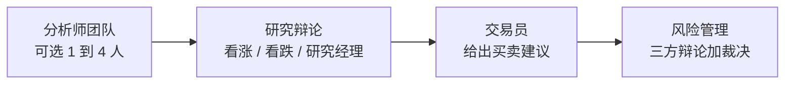
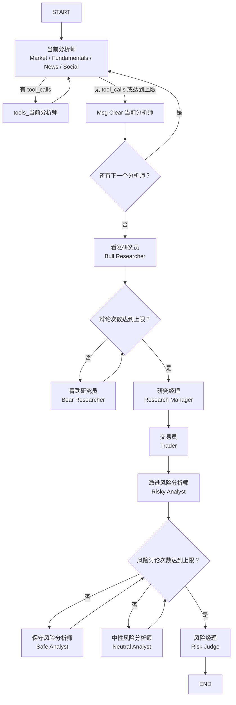
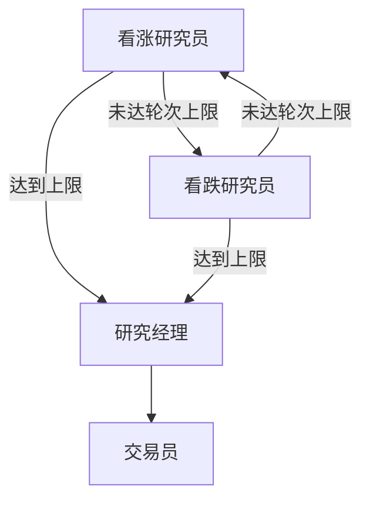
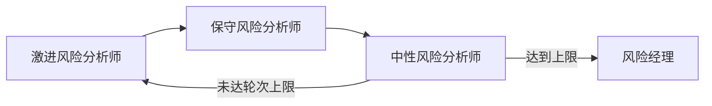

# TradingAgents 百问百答

> 更新日期：2026-10-09

## 1. 项目中的 AKShare 数据源是什么？

AKShare 不是项目内置的一份本地数据库，而是一个开源 Python 金融数据接口库。TradingAgents-CN 通过 AKShare SDK 调用公开互联网金融接口，并将获取到的数据转换为项目统一使用的格式。

项目中的 AKShare 主要提供以下数据：

- A 股股票代码和名称列表；
- 实时行情和个股盘口；
- 日线、周线、月线及分钟级 K 线；
- 主要财务指标、资产负债表、利润表和现金流量表；
- 个股新闻、市场新闻和上市公司公告；
- 部分港股数据支持。

从当前源码可以明确看到，AKShare 接入的数据上游包括：

- 东方财富：实时行情、个股盘口、财务报表、个股新闻和公告等；
- 新浪财经：A 股实时行情备用接口；
- 央视：市场新闻接口；
- AKShare 封装的其他公开金融数据接口。

因此，AKShare 本身更像一个“公开金融数据聚合与标准化工具”，并不是证券交易所官方行情服务。它免费且无需 Tushare Token，但公开接口可能受到网页改版、反爬策略、网络状况和访问频率限制的影响。项目为此增加了超时、重试、缓存、请求延迟和限流处理。

在中国市场数据源管理中，默认远程数据源顺序为：

```text
AKShare → Tushare → BaoStock
```

MongoDB 本地缓存的读取优先级更高。如果缓存中已有可用数据，实际查询不一定会访问 AKShare。默认数据源也可以通过 `DEFAULT_CHINA_DATA_SOURCE` 配置进行调整。

主要实现位置：

- `tradingagents/dataflows/providers/china/akshare.py`：核心统一数据提供器；
- `app/services/data_sources/akshare_adapter.py`：FastAPI 服务层数据源适配器；
- `tradingagents/dataflows/data_source_manager.py`：数据源选择、调用与降级逻辑；
- `tradingagents/constants/data_sources.py`：数据源元数据定义；
- `tradingagents/config/providers_config.py`：AKShare 超时、重试和缓存配置。

## 2. AKShare 是什么公司开发的？

AKShare 不是东方财富、新浪财经等数据上游公司开发的产品，也不是一家名为“AKShare”的商业公司提供的服务。

它是由 **AKFamily 开源团队及社区**开发和维护的开源项目，源码托管在 GitHub：

- <https://github.com/akfamily/akshare>

TradingAgents-CN 的数据源定义中也将 AKShare 的提供方标记为 `AKFamily`。

需要区分两个概念：

- **开发维护方**：AKFamily 开源团队及社区；
- **数据上游方**：东方财富、新浪财经、央视等公开金融数据网站或接口。

## 3. 使用手册中的“执行一次单股同步测试”是什么功能，怎么操作？

“单股同步测试”不是单元测试，而是针对一只股票执行一次真实的数据同步冒烟测试，用于确认以下链路是否正常：

- 数据源接口是否可访问；
- 股票行情、历史数据、财务数据或基础数据是否能正常获取；
- 数据转换和字段标准化是否正常；
- 数据是否成功写入 MongoDB；
- 主数据源失败时，回退数据源是否生效。

这项操作会产生实际的数据写入，不建议把它理解为“只读检查”。

### 页面操作步骤

1. 启动后端和前端并登录系统。
2. 打开一只 A 股的股票详情页，例如 `000001`。港股和美股详情页当前不显示“同步数据”按钮。
3. 点击右上角的“同步数据”。
4. 在弹窗中选择同步内容：
   - 实时行情；
   - 历史行情数据；
   - 财务数据；
   - 基础数据。
5. 选择数据源 `Tushare` 或 `AKShare`。如果勾选了历史行情，还需要设置历史数据天数，范围为 1～3650 天。
6. 点击“开始同步”。
7. 查看结果弹窗，确认各项成功状态、实际使用的数据源、错误原因，以及行情是否写入 `market_quotes`。

第一次验证建议只勾选“实时行情”，并选择 `AKShare`，这样请求范围小，便于快速判断数据源和数据库写入是否正常。

### 一个容易混淆的行为

页面默认选择的是“实时行情”和 `Tushare`，但后端对单股实时行情做了特殊处理：

1. 如果请求数据源是 Tushare，系统会先自动切换到 AKShare，以避免 Tushare 单股接口限制；
2. 如果 AKShare 单股同步失败，系统会回退到 Tushare 全量实时同步；
3. 结果弹窗会展示实际使用的数据源、尝试过的数据源和主链路/回退链路错误。

因此，页面上选择的“请求数据源”不一定等于最终实际使用的数据源。

### 同步内容与落库位置

| 同步内容 | 主要作用 | 典型落库位置 |
| --- | --- | --- |
| 实时行情 | 获取当前或最近可用的行情快照 | `market_quotes` |
| 历史行情 | 按指定天数同步日线等历史记录 | 历史行情集合，并将最新记录择优同步到 `market_quotes` |
| 财务数据 | 获取财务指标、资产负债表、利润表、现金流量表等 | 财务数据集合 |
| 基础数据 | 获取股票名称、市场、行业等基础信息 | `stock_basic_info` |

### 通过接口操作

前端调用的接口是：

```http
POST /api/stock-sync/single
```

例如，只测试股票 `000001` 的 AKShare 实时行情：

```json
{
  "symbol": "000001",
  "sync_realtime": true,
  "sync_historical": false,
  "sync_financial": false,
  "sync_basic": false,
  "data_source": "akshare",
  "days": 30
}
```

该接口需要登录认证。页面操作更适合日常使用，因为页面会自动显示同步明细，并在完成后刷新行情和基本面数据。

相关源码位置：

- `frontend/src/views/Stocks/Detail.vue`：同步按钮、弹窗和结果展示；
- `frontend/src/api/stockSync.ts`：单股同步接口封装；
- `app/routers/stock_sync.py`：单股同步 API 及落库逻辑；
- `app/worker/akshare_sync_service.py`：AKShare 行情和历史数据同步服务。

## 4. Tushare 是什么？

Tushare 是一个面向中国金融市场的财经数据接口平台，同时提供 Python 数据库和 Tushare Pro API，主要用于量化交易、投资研究和金融数据分析。

Tushare 可以提供以下类型的数据：

- A 股股票基本信息和交易日历；
- 历史行情及部分实时行情；
- 财务报表和财务指标；
- 分红、融资融券、资金流向等市场数据；
- 新闻和部分宏观经济数据。

使用 Tushare 通常需要申请 `Token`，不同接口还可能受到积分、权限、调用频率或付费等级限制。因此，Tushare 更准确地说是一个**金融数据接口项目及数据服务平台**，不是券商，也不是交易系统。

在 TradingAgents-CN 中，Tushare 是 A 股数据源之一。项目通过 `tushare` Python 库访问 Tushare Pro API，并可同步股票基础信息、行情、历史数据、财务数据和新闻到 MongoDB。相关配置项包括：

```bash
TUSHARE_TOKEN=your_token_here
TUSHARE_ENABLED=true
```

项目通常将 Tushare 视为专业级数据源；当 Tushare 不可用或未启用时，可以根据数据源管理配置降级到 AKShare 或 BaoStock。Tushare 的核心接入实现位于 `tradingagents/dataflows/providers/china/tushare.py`。

## 5. 单股分析报告有很多栏目，应该如何快速阅读？

单股分析结果不是 12 份互相独立的报告，而是一条“从资料到决策”的分析链路。默认选择市场分析师和基本面分析师时，通常会看到约 12 个有内容的栏目；如果同时启用新闻分析师和社媒分析师，可能增加到约 14 个。实际显示数量以当前页面中有内容的栏目为准。

### 最快阅读顺序

建议按“结论 → 计划 → 风险 → 依据 → 反方观点”的顺序阅读，不要从第一个栏目开始逐字通读：

1. **最终交易决策**：先看买入、持有、卖出或观望，以及目标价、信心和风险等级。
2. **交易员计划**：确认入场条件、仓位安排、止盈止损和适用的投资周期。
3. **投资组合经理**：查看最大风险，以及是否需要降低仓位、等待确认或暂不交易。
4. **研究经理决策**：看多头与空头讨论后形成的共识，以及仍然存在的分歧。
5. **市场技术分析**：关注趋势方向、支撑位、压力位和成交量是否配合。
6. **基本面分析**：关注盈利、现金流、估值，以及基本面能否支持当前股价。

看完以上 6 个栏目，通常就能完成第一次判断。其余栏目按需查看：

| 栏目 | 适合回答的问题 |
| --- | --- |
| 新闻事件分析 | 最近是否有公告、政策、业绩或突发事件影响股价？ |
| 市场情绪分析 | 短线市场情绪、热点和资金偏好如何？ |
| 多头研究员 | 上涨逻辑是否充分？ |
| 空头研究员 | 有哪些风险、反例或下跌理由？ |
| 激进分析师 | 高收益、高波动方案是否值得承担？ |
| 保守分析师 | 防守策略和低仓位方案是什么？ |
| 中性分析师 | 多空分歧较大时，如何等待确认？ |

### 只记录 7 个答案

阅读时不必做长笔记，只需提炼以下信息：

```text
当前方向：
核心理由：
入场条件：
止盈目标：
止损/判断失效条件：
适用周期：
最大风险：
```

### 如何理解不同栏目之间的矛盾

- 技术面看涨、基本面偏弱：可能是短线机会，但不代表适合长期持有；
- 基本面看好、技术面下跌：公司质量可能不错，但买入时机尚未确认；
- 多头和空头结论不同：重点看最终决策是否说明了分歧，以及交易计划是否设置了明确的确认条件和止损条件。

报告结论仅供研究参考，不构成投资建议。最终决策前应核对报告日期、行情数据时效性、适用时间周期和判断失效条件。

报告栏目里的“投资组合经理”，对应的是图节点 `Risk Judge`（风险经理），不是独立的投资组合经理智能体。一次分析实际上场的角色见第 6 问。

## 6. 执行一次股票分析会有哪些角色？

一次股票分析里真正上场的角色，以 `tradingagents/graph/setup.py` 装配的 LangGraph 节点为准，分成四段。默认全选分析师时是 **11 个智能体**；如果用户少选分析师，最少是 **1 个分析师 + 后面固定 8 人 = 9 人**。

默认分析师列表来自 `app/models/analysis.py`：

```python
selected_analysts: List[str] = Field(
    default_factory=lambda: ["market", "fundamentals", "news", "social"]
)
```

### 四阶段总览

后三段固定上场；分析师由 `selected_analysts` 决定，按选择顺序**串行**执行，不是并行。



### 完整节点顺序

下图对应 `GraphSetup.setup_graph()` 的实际边。分析师跑完会进入 `Msg Clear` 清消息，再交给下一位；最后一位分析师交给看涨研究员。研究辩论和风险辩论的轮次分别由 `max_debate_rounds`、`max_risk_discuss_rounds` 控制。



### 1. 分析师团队（可选，1 到 4 人）

默认顺序是市场 → 基本面 → 新闻 → 社媒。每个人用 `quick_thinking_llm`，并各自绑定工具节点。

| 角色 | 图节点 | 干什么 |
| --- | --- | --- |
| 市场分析师 | `Market Analyst` | 行情、技术指标、趋势 |
| 基本面分析师 | `Fundamentals Analyst` | 财务、估值、公司质地 |
| 新闻分析师 | `News Analyst` | 新闻、政策、宏观事件 |
| 社交媒体分析师 | `Social Analyst` | 舆论和投资者情绪 |


用户少选几个，后面的研究、交易、风险环节照样会跑。

### 2. 研究辩论（固定 3 人）

分析师报告齐了之后，看涨和看跌来回辩，够轮次后交给研究经理。看涨、看跌用 `quick_thinking_llm`；研究经理用 `deep_thinking_llm`。

| 角色 | 图节点 | 干什么 |
| --- | --- | --- |
| 看涨研究员 | `Bull Researcher` | 找机会，反驳看空 |
| 看跌研究员 | `Bear Researcher` | 找风险，反驳看多 |
| 研究经理 | `Research Manager` | 当辩论主持，给出买入、卖出或持有，以及投资计划 |



### 3. 交易员（固定 1 人）

| 角色 | 图节点 | 干什么 |
| --- | --- | --- |
| 交易员 | `Trader` | 把研究经理的投资计划落成具体买卖建议、目标价、置信度 |

交易员使用 `quick_thinking_llm`。

### 4. 风险管理（固定 4 人）

交易员出建议后，按激进 → 保守 → 中性轮流辩，够轮次后由风险经理收口。前三位用 `quick_thinking_llm`；风险经理用 `deep_thinking_llm`。

| 角色 | 图节点 | 干什么 |
| --- | --- | --- |
| 激进风险分析师 | `Risky Analyst` | 偏向进取仓位 |
| 保守风险分析师 | `Safe Analyst` | 强调下行风险 |
| 中性风险分析师 | `Neutral Analyst` | 平衡两边 |
| 风险经理 | `Risk Judge` | 最终交易决策，图到此结束 |



前端报告栏目里的“投资组合经理”，展示的就是这位 `Risk Judge` 的裁决，不是另有一个投资组合经理节点。

### 容易混的两点

- **信号处理**（`SignalProcessor.process_signal()`）不是角色，只是把风险经理的最终文本抽成结构化 `decision`。
- 仓库里还有 `tradingagents/agents/analysts/china_market_analyst.py`，旧文档也写过投资组合经理，但**当前图没有挂这两个节点**，一次分析不会跑到他们。

相关源码位置：

- `tradingagents/graph/setup.py`：分析师、研究员、交易员、风险节点和边；
- `tradingagents/graph/trading_graph.py`：创建图并执行 `propagate()`；
- `app/models/analysis.py`：默认 `selected_analysts`；
- `docs/股票分析任务执行流程.md`：一次分析的完整调用链路。
