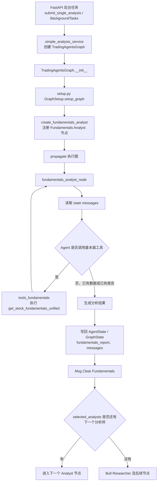
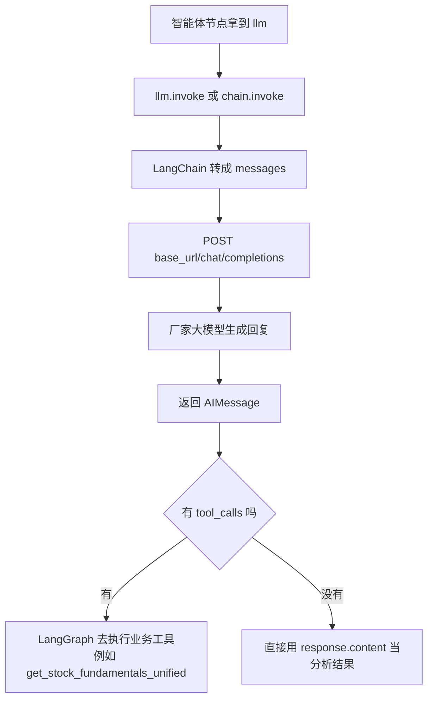

# 新手学习路线

本文面向刚接触 TradingAgents-CN 的新手，目标是帮助你先跑通项目，再按业务链路逐步理解代码，同时给出让 AI 快速读懂项目的提问方式。

读源码时若卡住 `-> dict:`、`async def`、`await`、函数内部再 `def` 嵌套函数，或 MongoDB 的 `$regex`（相当于 SQL `LIKE`），先看 [新手学 Python](新手学Python.md)。

## 一、先建立整体认识

不要一开始就横向阅读所有源码。先理解项目的四层结构：

- `frontend/`：前端交互层，负责页面、表单、状态展示和 API 调用。
- `app/`：后端 API 层，负责接口、认证、任务编排、配置、队列和持久化。
- `tradingagents/`：智能体分析核心层，负责 LangGraph 多智能体分析、数据工具、LLM 适配和交易决策生成。
- `docker/`、`nginx/`、`scripts/`：基础设施层，负责部署、启动、停止、初始化和运维脚本。

建议先阅读：

- `frontend/README.md`
- `app/README.md`
- `tradingagents/README.md`
- `docker/README.md`
- `tradingagents/dataflows/README.md`
- `project-architecture.md`

## 二、四层架构新手解释

可以把这个项目理解成一个“股票分析系统”的四层流水线：

```text
浏览器页面 frontend
  -> 后端接口 app
  -> 智能体分析核心 tradingagents
  -> 运行环境和基础组件 docker / nginx / scripts
```

### 1. `frontend/`：前端交互层

**它解决什么问题**：用户看到的页面都在这里，比如登录、提交股票分析、查看进度、查看报告、配置模型和数据源。

**主要目录**：

- `frontend/src/views/`：页面，比如分析页面、报告页面、配置页面。
- `frontend/src/api/`：调用后端接口的地方。
- `frontend/src/router/`：页面路由，决定访问哪个页面。
- `frontend/src/stores/`：前端全局状态，比如登录状态、通知状态。
- `frontend/src/components/`：可复用组件。

**新手先看**：

- `frontend/README.md`
- `frontend/src/main.ts`
- `frontend/src/api/`
- `frontend/src/views/`

你可以把它理解成：用户点按钮，前端把请求发给 `app/`。

### 2. `app/`：后端 API 层

**它解决什么问题**：接收前端请求，做认证、参数校验、任务创建、配置读取、进度保存、报告保存、队列调度等。

**主要目录**：

- `app/main.py`：FastAPI 启动入口。
- `app/routers/`：接口入口，比如登录接口、分析接口、报告接口。
- `app/services/`：业务逻辑，比如创建分析任务、查询股票、调度任务。
- `app/models/`：接口和数据库用到的数据结构。
- `app/core/`：配置、数据库、Redis、日志、限流。
- `app/worker/`：后台同步和长任务。

**新手先看**：

- `app/README.md`
- `app/main.py`
- `app/routers/analysis.py`
- `app/services/simple_analysis_service.py`

你可以把它理解成：前端说“我要分析这只股票”，`app/` 负责接单、排队、调用核心分析、保存结果。

### 3. `tradingagents/`：智能体分析核心层

**它解决什么问题**：真正做“多智能体股票分析”。这里会组织分析师、研究员、交易员、风险管理等智能体，用 LLM 和行情、新闻、基本面数据生成最终分析结论。

**主要目录**：

- `tradingagents/graph/`：LangGraph 工作流，决定智能体怎么串起来。
- `tradingagents/agents/`：各种智能体节点，比如分析师、研究员、交易员、风险管理。
- `tradingagents/dataflows/`：股票行情、新闻、基本面等数据来源。
- `tradingagents/llm_clients/`：LLM 客户端工厂。
- `tradingagents/llm_adapters/`：兼容 OpenAI 风格的模型适配。
- `tradingagents/config/`：核心库配置和用量统计。

**新手先看**：

- `tradingagents/README.md`
- `tradingagents/graph/trading_graph.py`
- `tradingagents/graph/setup.py`
- `tradingagents/dataflows/README.md`
- `tradingagents/dataflows/data_source_manager.py`

你可以把它理解成：`app/` 把任务交过来，`tradingagents/` 真正组织智能体完成分析。

### 4. `docker/`：基础设施层

**它解决什么问题**：让项目能跑起来。包括 Docker、Nginx、MongoDB、Redis、启动脚本、停止脚本、初始化脚本等。

**主要位置**：

- `docker/`：Docker 场景下的配置。
- `docker-compose.yml`：容器编排入口。
- `nginx/`：前端静态资源和后端 API 代理。
- `scripts/`：启动、停止、初始化、维护、校验脚本。
- `.env`：本地配置。

**新手先看**：

- `docker/README.md`
- `docker-compose.yml`
- `nginx/nginx.conf`
- `scripts/`

你可以把它理解成：它不写业务规则，只负责把前端、后端、数据库、缓存、代理服务组合起来运行。
详细项目架构文档见目录：`architecture/`。

## 三、先跑起来

先让项目能运行，再回头看源码会更容易。

后端和 Web 辅助界面：

```bash
pip install -r requirements.txt
python web/run_web.py
```

前端开发环境：

```bash
cd frontend
npm install
npm run dev
```

容器化方式：

```bash
docker compose up --build
```

## 四、优先理解一条主链路

推荐从“用户发起一次股票分析”这条业务链路开始：

```text
frontend/src/views/
  -> frontend/src/api/
  -> app/routers/analysis.py
  -> app/services/simple_analysis_service.py
  -> tradingagents/graph/trading_graph.py
  -> tradingagents/agents/
  -> tradingagents/dataflows/
  -> 返回分析报告
```

先看这些入口文件：

- `app/main.py`：后端启动入口。
- `app/routers/analysis.py`：分析接口入口。
- `app/services/simple_analysis_service.py`：分析任务编排。
- `tradingagents/graph/trading_graph.py`：核心分析图入口。
- `tradingagents/graph/setup.py`：LangGraph 节点和边的装配。
- `tradingagents/agents/analysts/fundamentals_analyst.py`：基本面分析师节点，适合作为第一条智能体调用链。
- `tradingagents/dataflows/data_source_manager.py`：A 股数据源管理。

智能体从图入口到基本面节点、再按 `selected_analysts` 进入后续节点的细节，见[第十节](#十智能体调用流程以基本面分析师为例)。

## 五、分阶段学习建议

第 1 天：阅读四层 README，能说清楚每层负责什么。  
第 2 天：跑通后端、Web 或前端页面。  
第 3 天：追踪一次股票分析任务的完整调用链路，阅读文档：[股票分析执行流程](股票分析执行流程_20260922.md), [股票分析任务执行流程](股票分析任务执行流程.md)。  
第 4 天：阅读 `tradingagents/dataflows/`，理解行情、新闻、基本面数据从哪里来。  
第 5 天：阅读 `tradingagents/graph/` 和 `tradingagents/agents/`，先按[第十节](#十智能体调用流程以基本面分析师为例)把基本面分析师调用链走通，再理解多智能体如何协作。
第 6 天：尝试改一个小功能，例如调整页面文案、增加一个日志字段或补充一个接口说明。  

## 六、配套文档阅读指引

下面三份文档分别覆盖“如何启动”“遇到登录问题怎么办”和“数据保存在哪里”三个新手最常见的问题。建议在第 2～4 天按“先启动、再排障、后看数据”的顺序阅读，不必一次读完全部细节。

| 文档 | 适合什么时候看 | 重点了解什么 |
| --- | --- | --- |
| [启动方式_v1.0.1_20260827.md](guides/启动方式_v1.0.1_20260827.md) | 第 2 天，第一次运行项目前 | Docker Compose、源码开发和旧版 Streamlit 三种方式的差异；`.env` 准备；前后端及 MongoDB、Redis 端口；启动后的首次配置和健康检查。优先选择 Docker Compose 跑通主流程，再按需学习源码开发模式。 |
| [开发问题解决指南_20260907.md](guides/开发问题解决指南_20260907.md) | 启动后登录失败或执行管理脚本时报错时 | 区分 Vue + FastAPI 主应用与旧版 Web/Streamlit 的认证数据；确认 MongoDB 连接到正确数据库；区分系统 Python 和项目虚拟环境；按场景处理默认账号、密码修改和依赖问题。涉及账号或数据库操作前，先核对环境，避免误改共享数据。 |
| [数据表汇总_20260907.md](analysis/数据表汇总_20260907.md) | 第 4 天，开始追踪数据读写或修改后端功能前 | MongoDB 集合与业务模块的对应关系；分析任务、报告、用户、配置、同步和模拟交易等核心集合；CN/HK/US 跨市场集合映射；当前主流程集合与旧版兼容集合的区别；通过数据库统计接口核对运行环境中的真实集合。 |

### 推荐阅读方法

1. 先读启动方式文档的“启动方式总览”和“启动后首次使用”，完成一次登录和单股同步。
2. 出现登录、密码、脚本依赖或数据库环境问题时，只阅读开发问题解决指南中对应的场景，不要直接套用其他场景的命令。
3. 追踪“提交分析 → 保存任务 → 生成报告”链路时，对照数据表汇总中的 `analysis_tasks`、`analysis_reports` 等集合，再回到代码确认具体字段和调用位置。
4. 看到带 `_hk`、`_us` 后缀或“旧版/兼容”的集合时，先确认当前功能是否实际使用；不要仅凭历史脚本执行迁移、清理或删除操作。

## 七、让 AI 快速读懂项目

给 AI 提问时，要限定范围、指定入口、要求输出结构。不要只说“帮我看看这个项目”。

推荐提示词：

```text
请使用 Serena 分析当前项目。
我想理解“一次股票分析任务”的完整链路。
请从 app/routers/analysis.py 开始，追踪到 app/services/simple_analysis_service.py，
再追踪到 tradingagents/graph/trading_graph.py。
输出：
1. 调用链路
2. 每个文件职责
3. 关键函数/类说明
4. 新手需要先理解的概念
5. 不要修改代码
```

另一个入门提示词：

```text
我是 Python/FastAPI 新手。
请用新手能懂的方式解释这个项目的四层架构：
frontend、app、tradingagents、docker。
每层说明它解决什么问题、主要目录、我应该先看哪些文件。
```

## 八、学习时的注意事项

- 先按业务动作纵向追踪，不要按目录横向扫源码。
- 先理解文件职责，再理解函数细节。
- 先看 `simple_analysis_service.py` 这种编排文件，再看底层工具。
- 遇到不懂的类或函数，优先问“它在完整链路中负责哪一步”。
- 不要一开始就深入所有智能体提示词、缓存、数据源降级和部署脚本。

最推荐的学习方法是：每次只选择一个真实动作，例如“登录”“提交分析”“查看报告”“同步股票数据”，让 AI 帮你从入口追到落库或返回结果。

## 九、新手常见问题 Q&A

### Q1：FastAPI 是什么？

FastAPI 是一个现代 Python Web 框架，用来快速构建 API 服务。它基于类型提示做参数校验（底层是 Pydantic），原生支持 `async/await` 异步并发，并会根据接口代码自动生成 `/docs`（Swagger UI）和 `/redoc` 在线接口文档。

最小示例：

```python
from fastapi import FastAPI

app = FastAPI()

@app.get("/tasks/{task_id}")
def get_task(task_id: int):
    return {"task_id": task_id, "status": "ok"}
```

用 `uvicorn app:app` 启动后，访问 `/tasks/1` 即可返回数据；如果 `task_id` 不是整数，FastAPI 会自动返回参数校验错误。

在本项目中的作用：后端 `app/` 目录就是基于 FastAPI 实现的。例如 `app/routers/analysis.py` 中的 `submit_single_analysis()` 接收单股分析请求，通过 `BackgroundTasks` 把耗时分析放到后台，接口立即返回 `task_id`；`get_current_user` 通过 `Depends()` 机制完成登录鉴权。可以简单理解为：**FastAPI 负责 HTTP 入口和异步调度，真正的股票分析由 `tradingagents/` 多智能体核心完成**。

### Q2：LangGraph 是什么？

LangGraph 是一个用于构建“有状态、多步骤智能体工作流”的 Python 框架。它把复杂任务组织成一张图：节点（Node）表示具体执行步骤，边（Edge）表示执行顺序，条件边（Conditional Edge）根据当前结果决定下一步走向，状态（State）在各节点之间传递共享数据。

在本项目中，它负责组织多智能体股票分析流程：

```text
市场分析
  -> 基本面分析
  -> 看涨/看跌研究员辩论
  -> 风险评估
  -> 交易信号处理
  -> 保存分析结果
```

对应到代码里，`tradingagents/graph/setup.py` 使用 `StateGraph(AgentState)` 创建图结构，通过 `add_node()`、`add_edge()`、`add_conditional_edges()` 装配分析师、研究员、交易员和风险管理节点；`tradingagents/graph/trading_graph.py` 中的 `TradingAgentsGraph.propagate()` 再通过 `self.graph.stream()` 执行整个工作流。可以简单理解为：**FastAPI 负责把请求接下来并启动任务，LangGraph 负责在后台按图执行多智能体分析流程**。

### Q3：`llm.invoke(messages)` 是什么？怎么调用大模型？

它**不是**本项目自定义的业务工具（例如 `get_stock_fundamentals_unified`），而是 LangChain 聊天模型对象的同步调用入口。智能体节点拿到的 `llm` 已经配好模型名、API 地址和密钥，`invoke()` 负责把提示发给大模型，并返回一条 `AIMessage`。

更细的调用方式和代码对照见[第十节第 5 小节](#5-llminvoke-如何调用大模型)。

更细的节点级调用链见下一节。

### Q4：`-> dict:`、`async def`、`await` 是什么？

这三处是读本项目 Python 代码时最常见的语法门槛，不是业务概念。

- `-> dict:` 是返回类型注解，约定函数返回字典，运行时不强制检查。
- `async def` 把函数声明成协程，调用后不会立刻跑完。
- `await` 暂停当前函数，等到那个异步调用真正结束，再拿到真实结果。

项目对照见 `tradingagents/utils/stock_validator.py` 的 `prepare_stock_data_async()`，以及 `app/services/simple_analysis_service.py` 中的 `await prepare_stock_data_async(...)`。完整说明见 [新手学 Python](新手学Python.md)。

### Q5：为什么 `execute_analysis_background` 里面还要 `def create_progress_tracker()`？

这是嵌套函数 / 闭包，不是再定义一套独立服务。外层是 `async`，跑在 FastAPI 事件循环上；内层把同步、可能阻塞的 Redis 进度器构造包起来，交给 `asyncio.to_thread()`，避免卡住整个服务。内部函数还能直接用外层的 `task_id`、`request`，少传一堆参数。

同一文件里的 `update_progress_sync()`、`simulate_progress()`、`graph_progress_callback()` 也是这个套路。完整说明见 [新手学 Python](新手学Python.md) 第五节。

### Q6：`config.py` 里的 `Settings()` 是怎么读到 `.env` 的？

`Settings()` 不是普通函数，而是 `pydantic_settings.BaseSettings` 的子类实例化。真正指定读哪个文件的是 `app/core/config.py` 里这一行：

```python
model_config = SettingsConfigDict(env_file=".env", env_file_encoding="utf-8", extra="ignore")

settings = Settings()
```

`settings = Settings()` 一执行，`pydantic-settings` 就会解析当前工作目录下的 `.env`，按字段名（如 `MONGODB_HOST`、`JWT_SECRET`）匹配并做类型转换。没有手写 `open(".env")` 或 `load_dotenv()`。

优先级从低到高：

1. `Field(default=...)` 里的默认值
2. `.env` 文件
3. 进程环境变量 `os.environ`（会覆盖 `.env`）

`.env` 路径相对的是启动时的当前工作目录，一般是仓库根，不是 `app/core/`。`extra="ignore"` 表示 `.env` 里多出来、`Settings` 没有对应字段的键直接丢掉，所以 LLM API Key 等未声明变量不会导致启动失败。别的模块 `from app.core.config import settings` 拿到的是模块加载时已经读完的那一个实例。

### Q7：MongoDB 里怎么写类似 SQL `LIKE` 的模糊查询？

MongoDB 没有 `LIKE`，对应写法是 `$regex`。读到 `{"name": {"$regex": keyword, "$options": "i"}}` 时，直接理解成：**这个字段做模糊包含匹配，并且忽略大小写**。

项目对照：

- `app/routers/stock_data.py`：6 位数字按代码精确匹配，否则名称用 `$regex`；关键词带数字时，代码也做一次正则。
- `app/routers/reports.py`：关键词同时打到 `stock_symbol`、`analysis_id`、`summary`。
- `app/services/database_screening_service.py`：前端 `contains` 映射成 `$regex`。

完整对照表和注意事项见 [新手学 Python](新手学Python.md) 第六节。

## 十、智能体调用流程（以基本面分析师为例）

第 5 天阅读 `tradingagents/graph/` 和 `tradingagents/agents/` 时，不要先横向看所有智能体。先沿一条真实调用链走完：从 FastAPI 后台任务进入图，再进入基本面分析师节点，最后按 `selected_analysts` 接到后续节点。

代码里的共享状态类型是 `AgentState`（`tradingagents/agents/utils/agent_states.py`），LangGraph 运行时把它当作 GraphState 在节点之间传递。下面说的“写回 GraphState”，指的就是写回这份 `AgentState`。

### 1. 实际调用链

```text
FastAPI 后台任务
↓
TradingAgentsGraph
↓
setup.py 注册 Fundamentals Analyst
↓
fundamentals_analyst_node()
↓
读取 state["messages"]
↓
调用 create_fundamentals_analyst()
↓
Agent 判断是否调用基本面工具
↓
生成分析结果
↓
返回并写回 GraphState
↓
根据 selected_analysts 进入后续节点
```

对应到源码时，有一个容易混淆的先后关系：

- **装配时**：`GraphSetup.setup_graph()` 调用 `create_fundamentals_analyst(llm, toolkit)`，得到节点函数 `fundamentals_analyst_node`，再注册为图节点 `"Fundamentals Analyst"`。
- **运行时**：`TradingAgentsGraph.propagate()` 执行图；轮到该节点时，真正进入的是 `fundamentals_analyst_node(state)`。它读取 `state["messages"]`，让 LLM 判断要不要调用基本面工具，再把报告写回状态。

也就是说，`create_fundamentals_analyst()` 是工厂函数，`fundamentals_analyst_node()` 是运行时节点。新手可以按上面的总览链记忆，再按下面的流程图和节点说明对照代码。

### 2. 调用流程图



分析师阶段不是并行同时跑完，而是按 `selected_analysts` 的顺序串行连接。默认常见顺序是 `market -> social -> news -> fundamentals`；最后一个分析师清理消息后，才进入看涨研究员。

### 3. 节点说明

| 步骤 | 代码位置 | 做什么 | 新手怎么理解 |
| --- | --- | --- | --- |
| FastAPI 后台任务 | `app/routers/analysis.py` 的 `submit_single_analysis()` | 接口先创建任务并立刻返回 `task_id`，再用 `background_tasks.add_task()` 把耗时分析丢到后台 | 用户提交后页面不用一直等；真正分析在后台跑 |
| 创建并执行图 | `app/services/simple_analysis_service.py` | `_get_trading_graph()` 按本次配置新建 `TradingAgentsGraph`，再调用 `propagate(stock_code, analysis_date, ...)` | 每次分析新建图实例，避免多任务互相污染状态 |
| 图入口 | `tradingagents/graph/trading_graph.py` | `__init__` 里调用 `setup_graph(selected_analysts)`；`propagate()` 用 `self.graph.stream()` 按节点推进 | 这里开始进入 LangGraph 工作流 |
| 注册基本面节点 | `tradingagents/graph/setup.py` | 若 `"fundamentals" in selected_analysts`，调用 `create_fundamentals_analyst()`，`add_node("Fundamentals Analyst", node)`，并挂上 `tools_fundamentals` 和 `Msg Clear Fundamentals` | 没选基本面分析师，这条支路不会进图 |
| 运行基本面节点 | `tradingagents/agents/analysts/fundamentals_analyst.py` 的 `fundamentals_analyst_node(state)` | 读取 `state["messages"]`、`company_of_interest`、`trade_date`；绑定 `get_stock_fundamentals_unified`；调用 LLM | 这是基本面分析真正干活的地方 |
| 判断是否调工具 | 同上，结合 `setup.py` 的条件边 `should_continue_fundamentals` | 先通过 `chain.invoke(...)` 问大模型；LLM 若返回 `tool_calls`，先去工具节点拿数据，再回到分析师节点生成报告；若消息里已有 `ToolMessage` 或已有足够分析内容，则不再调工具 | `invoke` 是问模型，真正拉数据的是基本面工具。详见[第 5 小节](#5-llminvoke-如何调用大模型) |
| 写回状态 | 节点 `return` 的字典 | 常见字段：`fundamentals_report`、`messages`、`fundamentals_tool_call_count`。LangGraph 会把这些字段合并进 `AgentState` | 后续研究员、交易员读的就是这份状态 |
| 进入后续节点 | `setup.py` 按 `selected_analysts` 连边 | 当前分析师 `Msg Clear` 后：若还有下一个分析师，就进下一个 `Xxx Analyst`；否则进 `Bull Researcher`，再进入研究经理、交易员、风险辩论、风险经理 | `selected_analysts` 既决定“有哪些分析师”，也决定“谁先谁后” |

基本面节点写回后，一条完整后续链通常是：

```text
Msg Clear Fundamentals
  -> 下一个分析师（若 selected_analysts 里还有）
  -> Bull Researcher
  -> Bear Researcher
  -> Research Manager
  -> Trader
  -> Risky / Safe / Neutral Analyst
  -> Risk Judge
  -> END
```

### 4. 对照阅读建议

顺着这条链看代码时，只需要打开这几个文件：

1. `app/routers/analysis.py`：看 `BackgroundTasks` 如何把任务丢到后台。
2. `app/services/simple_analysis_service.py`：看 `TradingAgentsGraph` 如何创建，以及 `propagate()` 何时被调用。
3. `tradingagents/graph/trading_graph.py`：看图如何装配和执行。
4. `tradingagents/graph/setup.py`：看 `"Fundamentals Analyst"`、`tools_fundamentals`、`Msg Clear Fundamentals` 如何按 `selected_analysts` 连边。
5. `tradingagents/agents/analysts/fundamentals_analyst.py`：看节点如何读 `messages`、是否调用工具、如何生成并返回 `fundamentals_report`。
6. `tradingagents/agents/utils/agent_states.py`：看 GraphState / `AgentState` 里有哪些字段会被写回。
7. `tradingagents/llm_clients/openai_client.py`：看 `llm` 对象从哪来，以及 `invoke()` 如何把请求发到厂家接口。

先把“后台任务 -> 图装配 -> 基本面节点 -> 写回状态 -> 下一个节点”说清楚，再去看提示词、数据源降级和工具防重入细节。看智能体源码时，一旦遇到 `llm.invoke(...)` 或 `chain.invoke(...)`，先对照下面第 5 小节，分清“问大模型”和“调数据工具”。

### 5. `llm.invoke()` 如何调用大模型

第十节前面的“Agent 判断是否调用基本面工具”，第一步其实是问大模型，不是直接拉财务数据。问大模型的入口就是 `llm.invoke(...)`。

#### 它是什么

`llm` 一般是图初始化时由 `create_llm_client().get_llm()` 造出来的聊天客户端，本项目里常见类型是 `NormalizedChatOpenAI`（对 LangChain `ChatOpenAI` 包了一层，用来把部分厂家返回的结构化 content 压成纯文本）。对象里已经带上了：

- `model`：模型名
- `base_url`：厂家 API 地址
- `api_key`：密钥
- `timeout` / `max_tokens` 等参数

因此节点里写 `llm.invoke(...)`，意思是：**用已经配好的这个模型，发一次对话请求**。

创建位置：`tradingagents/llm_clients/openai_client.py` 的 `OpenAIClient.get_llm()`。

#### 调用链路

```text
智能体节点拿到 llm
↓
llm.invoke(input)
  或  prompt | llm.bind_tools(tools) 后再 chain.invoke(...)
↓
LangChain 把 input 转成 messages
↓
POST {base_url}/chat/completions
↓
厂家大模型生成回复
↓
返回 AIMessage
  - 普通文本：读 response.content
  - 需要拉数据：还可能带 tool_calls
```



#### 项目里三种常见写法

| 写法 | 示例 | 典型位置 | 新手怎么理解 |
| --- | --- | --- | --- |
| 纯字符串 | `response = llm.invoke(prompt)` | 看涨/看跌研究员、研究经理、风险辩论 | 把整段中文提示直接丢给模型，读 `response.content` |
| 消息列表 | `llm.invoke([{"role": "system", ...}, {"role": "user", ...}])` | 新闻分析师、交易员 | 明确区分系统提示和用户提示 |
| 链式字典 | `chain = prompt \| llm.bind_tools(tools)` 然后 `chain.invoke({"messages": state["messages"]})` | 基本面分析师、市场分析师 | 先拼 prompt，再告诉模型可以发起工具调用 |

看涨研究员是最直白的一种：

```python
response = llm.invoke(prompt)
argument = f"Bull Analyst: {response.content}"
```

基本面分析师则是第二种“带工具”的写法：

```python
chain = prompt | fresh_llm.bind_tools(tools)
result = chain.invoke({"messages": state["messages"]})
```

#### 和业务工具的区别

这两件事不要混：

| 调用 | 在干什么 | 例子 |
| --- | --- | --- |
| `llm.invoke(...)` / `chain.invoke(...)` | 问大模型 | 让模型写报告，或让模型决定要不要调工具 |
| `get_stock_fundamentals_unified` | 拉财务/基本面数据 | 真正访问 Tushare / AKShare 等数据源 |

`bind_tools(tools)` 只是把工具说明书交给模型。模型如果返回 `tool_calls`，LangGraph 才会走进 `tools_fundamentals` 节点去执行数据工具；执行完再回到分析师节点，用工具结果生成报告。

可以记一句：**`invoke` 是问模型，工具函数才是查数据。**
