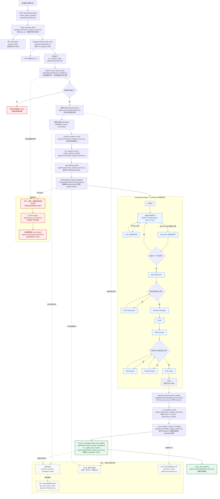

# 一次股票分析任务链路

本文基于 Serena 对 `app/routers/analysis.py`、`app/services/simple_analysis_service.py`、`tradingagents/graph/trading_graph.py` 和 `tradingagents/graph/setup.py` 的符号分析，说明一次单股分析任务从接口提交到生成结果的完整链路。

## 一、调用链路

```text
前端提交单股分析请求
  -> app/routers/analysis.py
     -> submit_single_analysis() [app/routers/analysis.py]
     -> get_simple_analysis_service() [app/services/simple_analysis_service.py]
     -> SimpleAnalysisService.create_analysis_task() [app/services/simple_analysis_service.py]
     -> background_tasks.add_task(run_analysis_task) [app/routers/analysis.py]

后台任务开始执行
  -> run_analysis_task() [app/routers/analysis.py]
  -> SimpleAnalysisService.execute_analysis_background() [app/services/simple_analysis_service.py]
     -> prepare_stock_data_async() [tradingagents/utils/stock_validator.py]
     -> RedisProgressTracker [app/services/progress/tracker.py]
     -> SimpleAnalysisService._execute_analysis_sync() [app/services/simple_analysis_service.py]
     -> SimpleAnalysisService._run_analysis_sync() [app/services/simple_analysis_service.py]
     -> create_analysis_config() [app/services/simple_analysis_service.py]
     -> SimpleAnalysisService._get_trading_graph() [app/services/simple_analysis_service.py]

进入智能体核心
  -> tradingagents/graph/trading_graph.py
     -> TradingAgentsGraph.__init__() [tradingagents/graph/trading_graph.py]
     -> GraphSetup.setup_graph() [tradingagents/graph/setup.py]
     -> TradingAgentsGraph.propagate() [tradingagents/graph/trading_graph.py]
     -> self.graph.stream() [tradingagents/graph/trading_graph.py]
     -> TradingAgentsGraph.process_signal() [tradingagents/graph/trading_graph.py]
     -> SignalProcessor.process_signal() [tradingagents/graph/signal_processing.py]

结果回到后端
  -> _run_analysis_sync() 组装 result [app/services/simple_analysis_service.py]
  -> _save_analysis_results_complete() [app/services/simple_analysis_service.py]
     -> _save_modular_reports_to_data_dir() [app/services/simple_analysis_service.py]
     -> _save_analysis_result_web_style() [app/services/simple_analysis_service.py]
  -> memory_manager.update_task_status(...COMPLETED...) [app/services/memory_state_manager.py]
  -> _update_task_status(...COMPLETED...) [app/services/simple_analysis_service.py]
  -> create_and_publish() [app/services/notifications_service.py]

前端查询
  -> get_task_status_new() [app/routers/analysis.py]
  -> get_task_result() [app/routers/analysis.py]
```

## 二、任务执行流程图

下图对应上面的调用链路。实线表示任务按设计继续执行；左侧泳道展示从前端到后台，再到 LangGraph 和结果持久化的主路径；虚线表示进度、任务状态或查询数据的读写关系。接口返回 `task_id` 只代表后台任务已经注册，不代表分析完成。



阅读该图时注意：图中“当前分析师节点”是抽象节点，实际执行顺序由 `selected_analysts` 决定；`tools_当前分析师` 只有在 LLM 返回工具调用时才会进入；辩论和风险讨论的实际轮次由 `research_depth` 转换后的 `max_debate_rounds`、`max_risk_discuss_rounds` 控制。

## 三、每个文件职责

### `app/routers/analysis.py`

这是股票分析相关 HTTP API 的入口。它不直接做智能体分析，只负责接收请求、获取当前用户、创建后台任务、返回任务编号，以及提供任务状态和结果查询接口。

关键职责：

- `POST /single` 提交单股分析任务。
- `GET /tasks/{task_id}/status` 查询任务状态。
- `GET /tasks/{task_id}/result` 查询分析结果。
- 通过 `BackgroundTasks` 把耗时分析放到后台执行，避免 HTTP 请求一直阻塞。

### `app/services/simple_analysis_service.py`

这是单股分析任务的主要编排层。它连接路由、任务状态、MongoDB、Redis 进度、股票校验、模型配置和 `tradingagents/` 核心图。

关键职责：

- 创建任务 ID 和初始任务状态。
- 校验股票代码和分析日期。
- 创建 Redis 进度跟踪器。
- 组装研究深度、分析师、模型、供应商、API Key、后端地址等分析配置。
- 为每次任务创建新的 `TradingAgentsGraph` 实例，避免并发任务共享可变状态。
- 在线程池中执行同步分析逻辑。
- 保存分模块 Markdown 报告和 MongoDB 分析结果。
- 更新内存状态和数据库任务状态。

### `tradingagents/graph/trading_graph.py`

这是智能体分析核心入口。它负责创建 LLM 实例、工具节点、记忆组件、条件逻辑、图构建器和信号处理器，并运行 LangGraph 工作流。

关键职责：

- `create_llm_by_provider()` 根据 provider、model、backend_url、api_key 创建 LLM。
- `TradingAgentsGraph.__init__()` 初始化 LLM、工具、记忆、图组件和工作流。
- `TradingAgentsGraph.propagate()` 创建初始状态，运行图，记录节点耗时，生成最终交易决策。
- `process_signal()` 把最终文本决策转换成结构化 decision。

### `tradingagents/graph/setup.py`

这是 LangGraph 节点和边的装配文件。它决定分析师、研究员、交易员、风险分析师和风险裁决节点如何串联。

关键职责：

- 根据 `selected_analysts` 创建市场、新闻、社媒、基本面等分析师节点。
- 为分析师节点绑定工具节点。
- 创建 Bull/Bear 研究员、研究经理、交易员、风险分析师和风险经理。
- 定义图的执行顺序和条件跳转。
- 编译并返回可运行的 LangGraph 工作流。

## 四、关键函数和类说明

### `submit_single_analysis()`

位置：`app/routers/analysis.py`

这是单股分析提交入口。它接收 `SingleAnalysisRequest`，先调用 `create_analysis_task()` 创建任务并立即返回 `task_id`，然后用 `BackgroundTasks` 注册 `run_analysis_task()` 后台执行函数。

新手要点：接口返回“任务已启动”不代表分析完成，只代表任务已经进入后台。

### `get_simple_analysis_service()`

位置：`app/services/simple_analysis_service.py`

这是 `SimpleAnalysisService` 的单例获取函数。路由层通过它拿到服务实例。

新手要点：服务对象复用，但每次分析会新建 `TradingAgentsGraph`，避免多线程共享图内部状态。

### `SimpleAnalysisService.create_analysis_task()`

位置：`app/services/simple_analysis_service.py`

负责生成 `task_id`，校验股票代码是否为空，把任务写入内存状态管理器，并在 `analysis_tasks` 集合中创建初始记录。

新手要点：这是“创建任务”，不是“执行分析”。

### `SimpleAnalysisService.execute_analysis_background()`

位置：`app/services/simple_analysis_service.py`

这是后台任务主入口。它会校验股票数据，创建 Redis 进度跟踪器，把任务状态更新为运行中，然后调用 `_execute_analysis_sync()` 执行实际分析。完成后保存结果、更新状态并发送通知。

新手要点：这里负责“任务生命周期”，包括开始、进度、完成、失败和清理。

### `SimpleAnalysisService._execute_analysis_sync()`

位置：`app/services/simple_analysis_service.py`

把同步分析函数 `_run_analysis_sync()` 提交到共享线程池执行。

新手要点：智能体分析是耗时同步逻辑，所以这里用线程池避免阻塞 FastAPI 的事件循环。

### `SimpleAnalysisService._run_analysis_sync()`

位置：`app/services/simple_analysis_service.py`

这是实际分析编排函数。它读取请求参数，创建分析配置，实例化 `TradingAgentsGraph`，调用 `trading_graph.propagate()`，然后从返回的 `state` 和 `decision` 中提取摘要、建议、报告、性能指标并组装结果。

新手要点：这是 `app/` 层和 `tradingagents/` 层真正交界的地方。

### `create_analysis_config()`

位置：`app/services/simple_analysis_service.py`

把前端传入的研究深度、分析师、快速模型、深度模型、模型供应商和市场类型转换为核心层可用的配置。

新手要点：研究深度会影响辩论轮次、风险讨论轮次、是否启用记忆、是否使用在线工具。

### `SimpleAnalysisService._get_trading_graph()`

位置：`app/services/simple_analysis_service.py`

根据配置创建新的 `TradingAgentsGraph` 实例。

新手要点：代码中特意每次都新建图实例，因为 `TradingAgentsGraph` 内部有 `self.ticker`、`self.curr_state` 等可变状态，多任务共享会导致数据串扰。

### `TradingAgentsGraph.__init__()`

位置：`tradingagents/graph/trading_graph.py`

初始化核心分析图所需的 LLM、工具节点、记忆组件、条件逻辑、图构建器、传播器、反思器和信号处理器。

新手要点：这里是智能体系统的“组装工厂”。

### `GraphSetup.setup_graph()`

位置：`tradingagents/graph/setup.py`

创建并编译 LangGraph 工作流。典型顺序是：

```text
选中的分析师
  -> Bull Researcher
  -> Bear Researcher
  -> Research Manager
  -> Trader
  -> Risky / Safe / Neutral Analyst
  -> Risk Judge
  -> END
```

新手要点：这里决定智能体按什么顺序工作，以及什么时候调用工具、什么时候进入下一类角色。

### `TradingAgentsGraph.propagate()`

位置：`tradingagents/graph/trading_graph.py`

运行完整智能体图。它先创建初始状态，再通过 `self.graph.stream()` 流式执行每个节点，同时记录节点耗时、推送进度、累积最终状态，最后调用 `process_signal()` 得到结构化交易决策。

新手要点：真正的多智能体执行发生在这里。

### `TradingAgentsGraph.process_signal()`

位置：`tradingagents/graph/trading_graph.py`

委托 `SignalProcessor` 从最终交易决策文本中提取结构化字段，例如操作建议、目标价、置信度等。

新手要点：核心图最终返回的是 `final_state` 和 `decision` 两部分。

## 五、新手需要先理解的概念

### FastAPI 路由

`app/routers/analysis.py` 里的 `@router.post()` 和 `@router.get()` 定义了 HTTP 接口。前端不是直接调用 Python 函数，而是通过 HTTP 请求访问这些接口。

### 后台任务

股票分析耗时较长，所以 `submit_single_analysis()` 不会等分析完成，而是先返回 `task_id`。真实分析在 `BackgroundTasks` 中继续执行。

### 任务状态

任务状态同时存在于内存状态管理器和 MongoDB 中。内存用于快速查询，MongoDB 用于持久化和任务恢复。

### Redis 进度

`RedisProgressTracker` 用来记录分析进度和当前步骤。前端可以通过状态接口、WebSocket 或 SSE 类能力观察任务进展。

### 线程池

FastAPI 的异步事件循环不适合直接跑长时间同步计算。`_execute_analysis_sync()` 把 `_run_analysis_sync()` 放进线程池，避免卡住接口服务。

### LangGraph

`tradingagents/graph/setup.py` 用 `StateGraph` 把多个智能体节点串成工作流。每个节点处理一部分状态，然后把状态传给下一个节点。

### AgentState

智能体之间不是直接传普通字符串，而是传一个状态对象。状态里包含消息、市场报告、新闻报告、基本面报告、辩论记录、交易计划、风险结论和最终决策。

### 分析师和研究员的区别

分析师负责生成基础报告，例如市场、新闻、社媒、基本面。研究员和经理负责围绕这些报告做多空辩论、总结观点并形成投资计划。

### 快速模型和深度模型

项目支持快速模型和深度模型。快速模型常用于较轻的分析节点，深度模型常用于研究经理、风险经理等需要综合判断的节点。

### 结果保存

分析完成后，结果会被组装成 `result`，同时保存到本地 Markdown 报告目录和 MongoDB。前端查询结果时，会优先读任务状态中的结果，也会从 MongoDB 或本地报告兜底恢复。

## 六、按代码阅读的推荐顺序

1. `app/routers/analysis.py`：先看 `submit_single_analysis()`。
2. `app/services/simple_analysis_service.py`：看 `create_analysis_task()` 和 `execute_analysis_background()`，理解任务生命周期。
3. `app/services/simple_analysis_service.py`：看 `_execute_analysis_sync()` 和 `_run_analysis_sync()`，理解后端如何进入核心分析。
4. `app/services/simple_analysis_service.py`：看 `create_analysis_config()` 和 `_get_trading_graph()`，理解配置如何传给核心层。
5. `tradingagents/graph/trading_graph.py`：看 `TradingAgentsGraph.__init__()`，理解核心图初始化。
6. `tradingagents/graph/setup.py`：看 `GraphSetup.setup_graph()`，理解节点顺序。
7. `tradingagents/graph/trading_graph.py`：看 `TradingAgentsGraph.propagate()`，理解图如何运行并返回结果。
8. 回到 `app/routers/analysis.py`：看 `get_task_status_new()` 和 `get_task_result()`，理解前端如何查询状态和结果。

## 七、一句话总结

一次股票分析任务不是一个同步接口调用，而是“前端提交任务、后端创建后台任务、服务层编排进度和配置、核心层运行 LangGraph 多智能体、服务层保存结果、前端轮询或订阅结果”的完整异步流程。
