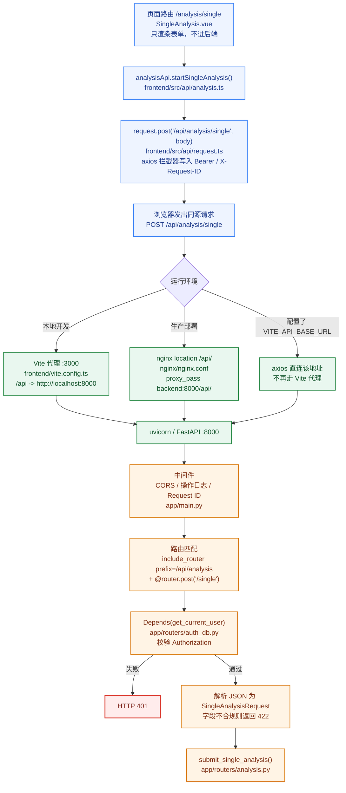
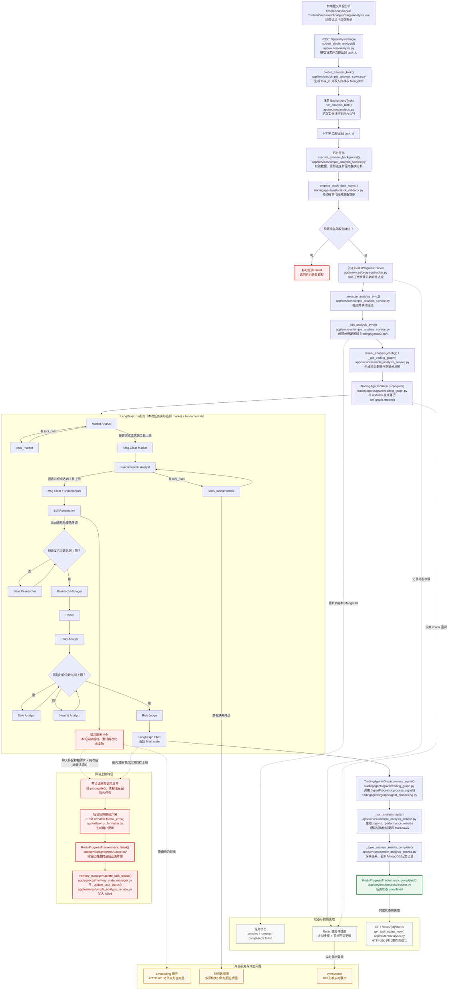

# 单股分析执行流程

## 1. 文档目的与范围

本文梳理 TradingAgents-CN 单股分析从前端提交、后台调度、数据准备、多智能体推理、进度更新到结果持久化的完整执行流程，并结合任务的运行日志，说明正常链路、实际执行位置、故障边界及后续验证方法。


## 2. 证据来源与限制

本次结论综合以下证据：

| 证据类型 | 主要来源 | 用途 |
| --- | --- | --- |
| 任务日志 | `logs/tradingagents.log.1`、`logs/tradingagents.log` | 还原任务时间线、节点切换、重试和最终异常 |
| 接口日志 | `logs/webapi.log`、`logs/error.log` | 核对状态查询、WebSocket 连接及伴随异常 |
| 前端源码 | `frontend/src/views/Analysis/SingleAnalysis.vue`、`frontend/src/api/analysis.ts`、`frontend/src/api/request.ts` | 确认页面如何组装请求、axios 如何带 token 发出 `POST /api/analysis/single` |
| 代理配置 | `frontend/vite.config.ts`、`nginx/nginx.conf`、`app/main.py` | 确认开发 Vite 代理、生产 nginx 转发，以及 FastAPI 路由前缀如何拼出完整路径 |
| 服务源码 | `app/routers/analysis.py`、`app/services/simple_analysis_service.py` | 确认请求入口、后台任务、线程池和失败处理 |
| 图执行源码 | `tradingagents/graph/trading_graph.py`、`tradingagents/graph/setup.py` | 确认 LangGraph 节点顺序和进度回调语义 |
| 进度源码 | `app/services/progress/tracker.py` | 确认动态步骤和 Redis 进度状态 |
| 记忆源码 | `tradingagents/agents/utils/memory.py` | 判断嵌入接口 401 的降级行为 |
| 项目文档 | `docs/一次股票分析任务链路.md` 等 | 交叉核对系统设计和历史处理口径 |

结论采用以下证据口径：直接日志事实为 L1，源码行为核对为 L2，跨日志关联或运行环境推断为 L3，尚未复测的原因候选为“待验证假设”。`.ua/knowledge-graph.json` 的更新时间早于本次分析日期，图谱仅用于定位；本文核心结论均以当前源码、项目文档和日志复核结果为准。建议执行 `$understand --language zh` 更新 Understand 图谱。

## 3. 前端请求链路

浏览器不认 Python 函数名。前端发出的是 `POST /api/analysis/single`，FastAPI 再靠「挂载前缀 + 装饰器路径 + HTTP 方法」把它绑到 `submit_single_analysis()`。

另外两条路径不要混：

| 路径 | 是什么 | 落到哪 |
| --- | --- | --- |
| `/analysis/single` | Vue Router 页面 | `frontend/src/views/Analysis/SingleAnalysis.vue`，只渲染表单 |
| `POST /api/analysis/single` | HTTP API | `app/routers/analysis.py` 的 `submit_single_analysis()` |

### 3.1 页面如何发出请求

用户在单股分析页点击提交后：

```text
SingleAnalysis.vue
  -> analysisApi.startSingleAnalysis(request)   [frontend/src/api/analysis.ts]
  -> request.post('/api/analysis/single', analysisRequest)   [frontend/src/api/request.ts]
```

`request` 是 axios 实例，`baseURL` 为 `import.meta.env.VITE_API_BASE_URL || ''`。默认 `baseURL` 为空，所以浏览器实际请求的是当前页面同源的：

```http
POST /api/analysis/single
Content-Type: application/json
Authorization: Bearer <token>
X-Request-ID: req_...
```

请求拦截器会从 `authStore` 或 `localStorage` 读取 token 并写入 `Authorization`。没有 token，后端 `get_current_user()` 会直接返回 401，处理函数不会执行。

### 3.2 请求如何到达 FastAPI :8000

浏览器默认不会直连后端。中间有一层反向代理，路径不改写。

**本地开发**（`frontend/vite.config.ts`，前端 `:3000`）：

```ts
proxy: {
  '/api': {
    target: 'http://localhost:8000',
    changeOrigin: true,
    ws: true
  }
}
```

流程：`浏览器 -> :3000/api/analysis/single -> Vite 原样转到 :8000/api/analysis/single`。这样避开跨域。

**生产**（`nginx/nginx.conf`）：

```nginx
location /api/ {
    proxy_pass http://backend/api/;   # upstream backend:8000
}
```

页面走 `/`，API 走 `/api/`。如果配置了 `VITE_API_BASE_URL`，axios 会直连该地址，不再走 Vite 代理。

### 3.3 FastAPI 如何对上 `submit_single_analysis()`

挂载在 `app/main.py`：

```python
app.include_router(analysis.router, prefix="/api/analysis", tags=["analysis"])
```

路由定义在 `app/routers/analysis.py`：

```python
router = APIRouter()

@router.post("/single", ...)
async def submit_single_analysis(...):
```

拼起来就是：

```text
prefix /api/analysis  +  @router.post("/single")  +  POST
= POST /api/analysis/single
-> submit_single_analysis()
```

进函数前还会做两件事：

1. **中间件**：CORS、操作日志、Request ID。
2. **依赖注入**
   - `user: dict = Depends(get_current_user)`：读取 `Authorization`，校验 JWT，查询用户；失败直接 401。
   - `request: SingleAnalysisRequest`：把 JSON body 校验成 Pydantic 模型；字段不对返回 422。
   - `background_tasks: BackgroundTasks`：由 FastAPI 自动注入。

过了这些才进入 `submit_single_analysis()`：先 `create_analysis_task()` 立刻返回 `task_id`，真正分析挂在 `BackgroundTasks` 里。后续步骤见第 4、5、6 节。

### 3.4 前端请求流程图



要点：函数名 `submit_single_analysis` 从不出现在 URL 里。前端能打到这个函数，是因为路径、方法和挂载前缀三者对上了。

## 4. 总体执行架构

单股分析采用“HTTP 请求快速返回任务 ID，后台异步执行分析，前端持续读取进度和结果”的方式。核心链路如下（文件名后为一句简要职责，详细说明见第 5 节）：

```text
前端提交单股分析请求（详见第 3 节）
  -> SingleAnalysis.vue [frontend/src/views/Analysis/SingleAnalysis.vue] 组装请求并提交表单
  -> analysisApi.startSingleAnalysis() [frontend/src/api/analysis.ts] 封装单股分析 API
  -> request.post('/api/analysis/single') [frontend/src/api/request.ts] axios 发出请求并写入 token
  -> Vite 代理或 nginx /api/ 转发到 :8000 [frontend/vite.config.ts / nginx/nginx.conf] 把同源 /api 转到 FastAPI
  -> FastAPI 路由 submit_single_analysis() [app/routers/analysis.py] 接收请求、创建任务并立即返回 task_id
  -> SimpleAnalysisService.create_analysis_task() [app/services/simple_analysis_service.py] 生成 task_id 并写入内存与 MongoDB
  -> 创建任务记录并注册 BackgroundTasks [app/routers/analysis.py] 把真实分析挂到后台执行
  -> HTTP 返回任务 ID

后台任务 run_analysis_task() [app/routers/analysis.py] 后台入口，转调分析服务
  -> SimpleAnalysisService.execute_analysis_background() [app/services/simple_analysis_service.py] 校验数据、跟踪进度并驱动整次分析
  -> prepare_stock_data_async() [tradingagents/utils/stock_validator.py] 校验股票代码、市场类型和分析日期
  -> 初始化 RedisProgressTracker [app/services/progress/tracker.py] 按分析师和研究深度生成进度步骤
  -> _execute_analysis_sync() [app/services/simple_analysis_service.py] 把同步分析提交到共享线程池
  -> 提交共享线程池 [app/services/simple_analysis_service.py] 避免阻塞 FastAPI 事件循环
  -> _run_analysis_sync() [app/services/simple_analysis_service.py] 编排配置、建图、跑分析和组装结果
  -> create_analysis_config() [app/services/simple_analysis_service.py] 把研究深度和模型参数转成核心层配置
  -> _get_trading_graph() [app/services/simple_analysis_service.py] 按本次配置新建 TradingAgentsGraph
  -> TradingAgentsGraph.propagate() [tradingagents/graph/trading_graph.py] 创建初始状态并运行完整智能体图
  -> LangGraph self.graph.stream() [tradingagents/graph/trading_graph.py] 按节点流式执行多智能体工作流
  -> TradingAgentsGraph.process_signal() [tradingagents/graph/trading_graph.py] 把最终决策文本交给信号处理器
  -> SignalProcessor.process_signal() [tradingagents/graph/signal_processing.py] 提取操作建议、目标价、置信度等结构化字段

正常完成
  -> _run_analysis_sync() 组装结构化结果 [app/services/simple_analysis_service.py] 从 state 和 decision 提取摘要、建议和报告
  -> _save_analysis_results_complete() 保存结果 [app/services/simple_analysis_service.py] 汇总保存本地报告和数据库结果
     -> _save_modular_reports_to_data_dir() 保存 Markdown 报告 [app/services/simple_analysis_service.py] 按模块写入本地 Markdown
     -> _save_analysis_result_web_style() 保存 MongoDB 结果 [app/services/simple_analysis_service.py] 按 Web 查询格式写入 MongoDB
  -> RedisProgressTracker.mark_completed() [app/services/progress/tracker.py] 标记进度完成
  -> memory_manager.update_task_status() [app/services/memory_state_manager.py] 更新内存任务状态为完成
  -> _update_task_status() [app/services/simple_analysis_service.py] 同步 MongoDB 任务状态
  -> create_and_publish() 创建完成通知 [app/services/notifications_service.py] 发布分析完成通知
  -> get_task_status_new() / get_task_result() 查询进度和结果 [app/routers/analysis.py] 供前端轮询任务状态和最终结果
```

### 4.1 全量执行流程图

下图把请求生命周期、数据准备、LangGraph 多智能体节点、结果持久化和失败路径放在同一条链路中展示。实线表示按设计继续执行的正常业务路径，不代表本次任务已走完全流程；橙色虚线表示已证实的降级或伴生问题，红色虚线表示本次任务实际失败路径；灰色虚线表示流程中记录的前端进度状态。



阅读该图时需要特别注意两个边界：

1. `Msg Clear Fundamentals -> Bull Researcher` 只证明流程已进入看涨研究员；聊天补全超时发生在该节点内部，不能据此断言看涨研究员已完成。
2. `Embedding 401`、财务数据缺失和 WebSocket 403 都应标为降级或伴生问题；只有聊天补全超时被源码和日志证实为本次直接失败路径。

该架构包含三类状态载体：

1. 任务状态：记录 `pending`、`running`、`completed` 或 `failed` 等生命周期状态。
2. Redis 进度：记录当前步骤、步骤总数、百分比和面向前端的阶段说明。
3. 图执行状态：由 LangGraph 节点输出及回调表示智能体实际运行位置。

三者更新时间和失败处理口径并不完全一致，排障时不能只读取其中一个状态源。

## 5. 核心链路函数详细说明

第 4 节链路中的文件名后只保留一句职责。本节按调用顺序列出各关键函数的位置、作用和排障要点。

### 5.1 请求接入

#### `SingleAnalysis.vue`

位置：`frontend/src/views/Analysis/SingleAnalysis.vue`

单股分析页。用户填写股票代码、研究深度、分析师和模型后，在这里组装 `SingleAnalysisRequest`，调用 `analysisApi.startSingleAnalysis()`。页面路由 `/analysis/single` 只负责渲染表单，不会直接打到后端。

#### `analysisApi.startSingleAnalysis()`

位置：`frontend/src/api/analysis.ts`

股票分析相关 API 封装。内部调用 `request.post('/api/analysis/single', analysisRequest)`，把前端请求体发到后端。

#### `request.post()`

位置：`frontend/src/api/request.ts`

全局 axios 实例。它设置 `baseURL`、超时、JSON 头，并在请求拦截器中写入 `Authorization: Bearer <token>` 和 `X-Request-ID`。默认 `baseURL` 为空，浏览器请求走当前页面同源路径，再由 Vite 或 nginx 转发。

#### Vite 代理 / nginx `location /api/`

位置：`frontend/vite.config.ts`、`nginx/nginx.conf`

开发环境由 Vite 把 `/api` 代理到 `http://localhost:8000`；生产环境由 nginx 的 `location /api/` 转发到 `backend:8000`。两条路径都不改写 URL，所以后端看到的仍是 `POST /api/analysis/single`。

### 5.2 任务创建与后台注册

#### `submit_single_analysis()`

位置：`app/routers/analysis.py`

单股分析 HTTP 入口。它接收 `SingleAnalysisRequest`，先调用 `create_analysis_task()` 创建任务并立即返回 `task_id`，再用 `BackgroundTasks` 注册 `run_analysis_task()`。接口返回“任务已启动”不代表分析完成，只代表任务已经进入后台。

#### `get_simple_analysis_service()`

位置：`app/services/simple_analysis_service.py`

`SimpleAnalysisService` 的单例获取函数。路由层通过它拿到服务实例。服务对象可复用，但每次分析都会新建 `TradingAgentsGraph`，避免多线程共享图内部状态。

#### `create_analysis_task()`

位置：`app/services/simple_analysis_service.py`

生成 `task_id`，校验股票代码是否为空，把任务写入内存状态管理器，并在 MongoDB `analysis_tasks` 集合中创建初始记录，状态为 `pending`。这是“创建任务”，不是“执行分析”。

#### `run_analysis_task()`

位置：`app/routers/analysis.py`

`BackgroundTasks` 的后台入口。HTTP 响应发出后，FastAPI 调用它，再转调 `execute_analysis_background()`。

### 5.3 数据准备、进度与线程池

#### `execute_analysis_background()`

位置：`app/services/simple_analysis_service.py`

后台任务主入口。它校验股票数据，创建 Redis 进度跟踪器，把任务状态更新为运行中，再调用 `_execute_analysis_sync()`。完成后保存结果、更新状态并发送通知。失败时捕获异常、格式化错误、标记 `failed` 并清理进度跟踪器。这里负责整次任务的生命周期。

#### `prepare_stock_data_async()`

位置：`tradingagents/utils/stock_validator.py`

校验股票代码、市场类型和分析日期，并尽量准备后续分析所需的基础数据。部分行情或财务数据适配器会尝试 MongoDB、AKShare、Tushare 等多个来源；若业务实现提供降级报告，流程仍可能继续进入智能体阶段，但输出质量会受影响。

#### `RedisProgressTracker`

位置：`app/services/progress/tracker.py`

按选中的基础分析师和研究深度动态生成进度步骤，并把当前步骤、百分比写入 Redis。前端通过状态接口、WebSocket 或 SSE 观察任务进展。完成时调用 `mark_completed()`，失败时调用 `mark_failed()`，后者会保留已推进的最后业务步骤。

#### `_execute_analysis_sync()`

位置：`app/services/simple_analysis_service.py`

把同步分析函数 `_run_analysis_sync()` 提交到共享线程池。智能体分析是耗时同步逻辑，不能直接跑在 FastAPI 事件循环里，否则会卡住接口服务。线程池内部异常会向上抛回后台任务。

#### `_run_analysis_sync()`

位置：`app/services/simple_analysis_service.py`

实际分析编排函数，也是 `app/` 层和 `tradingagents/` 层的交界。它读取请求参数，调用 `create_analysis_config()` 和 `_get_trading_graph()`，执行 `propagate()`，再从返回的 `state` 和 `decision` 中提取摘要、建议、报告、性能指标并组装结果。

### 5.4 分析配置与建图

#### `create_analysis_config()`

位置：`app/services/simple_analysis_service.py`

把前端传入的研究深度、分析师、快速模型、深度模型、供应商和市场类型，转换为核心层 `TradingAgentsGraph` 可直接使用的配置字典。它不跑分析，只做配置翻译，在 `_run_analysis_sync()` 线程池内、`_get_trading_graph()` / `propagate()` 之前执行。

主要做三件事：

1. **标准化研究深度**。前端可能传 `3`、`"3"` 或 `"标准"`。函数统一成中文等级：`1 快速 / 2 基础 / 3 标准 / 4 深度 / 5 全面`。无效值回落到 `"标准"`。
2. **按深度覆盖默认配置**。从 `DEFAULT_CONFIG.copy()` 起步，再按等级改辩论轮次、风险讨论轮次、是否启用记忆、是否使用在线工具。
3. **补齐核心层运行参数**。写入快速/深度模型名、供应商、选中的分析师、`backend_url`、API Key，以及 `max_tokens` / `timeout` 等模型参数。查不到数据库配置时，回退到默认 URL。

研究深度与关键配置的对应关系：

| 研究深度 | 辩论轮次 `max_debate_rounds` | 风险讨论轮次 `max_risk_discuss_rounds` | 记忆 `memory_enabled` | 在线工具 `online_tools` |
|---|---|---|---|---|
| 快速 | 1 | 1 | 关 | 开 |
| 基础 | 1 | 1 | 开 | 开 |
| 标准 | 1 | 2 | 开 | 开 |
| 深度 | 2 | 2 | 开 | 开 |
| 全面 | 3 | 3 | 开 | 开 |

这也是后文说「辩论/风险轮次由 `research_depth` 控制」的来源。配置写完后，调用方还会补上 `quick_provider` / `deep_provider` 和各自的 `backend_url`，以支持快慢模型走不同厂家。

#### `_get_trading_graph()`

位置：`app/services/simple_analysis_service.py`

根据本次 `config` 新建 `TradingAgentsGraph` 实例。代码特意每次都新建，因为图内部有 `self.ticker`、`self.curr_state` 等可变状态，多任务共享会导致数据串扰。

#### `TradingAgentsGraph.__init__()`

位置：`tradingagents/graph/trading_graph.py`

初始化核心分析图所需的 LLM、工具节点、记忆组件、条件逻辑、图构建器、传播器、反思器和信号处理器。这里是智能体系统的组装工厂。

#### `GraphSetup.setup_graph()`  调用LLM模型的关键节点

位置：`tradingagents/graph/setup.py`

创建并编译 LangGraph 工作流。它根据 `selected_analysts` 创建市场、新闻、社媒、基本面等分析师节点，绑定工具节点，再串联 Bull/Bear 研究员、研究经理、交易员、风险分析师和风险经理，最后编译成可运行图。典型顺序是：

```text
选中的分析师
  -> Bull Researcher
  -> Bear Researcher
  -> Research Manager
  -> Trader
  -> Risky / Safe / Neutral Analyst
  -> Risk Judge
  -> END
```

### 5.5 智能体执行与信号处理

#### `TradingAgentsGraph.propagate()`

位置：`tradingagents/graph/trading_graph.py`

运行完整智能体图。它先创建初始 `AgentState`，再通过 `self.graph.stream()` 流式执行每个节点，同时记录节点耗时、推送进度、累积最终状态，最后调用 `process_signal()` 得到结构化交易决策。真正的多智能体执行发生在这里。

#### `self.graph.stream()`

位置：`tradingagents/graph/trading_graph.py`（LangGraph 运行时）

按节点流式执行工作流，每次产出一个 `updates` chunk。`propagate()` 遍历这些 chunk，识别当前节点、回调进度跟踪器，并合并状态。分析师节点若返回 `tool_calls`，会先进入对应 `tools_*` 节点再回到分析师，直到报告完成或达到工具上限。

#### `TradingAgentsGraph.process_signal()`

位置：`tradingagents/graph/trading_graph.py`

委托 `SignalProcessor` 从最终交易决策文本中提取结构化字段。核心图最终返回的是 `final_state` 和 `decision` 两部分。

#### `SignalProcessor.process_signal()`

位置：`tradingagents/graph/signal_processing.py`

从最终决策文本中解析操作建议、目标价、置信度等结构化字段，供结果组装和前端展示使用。

### 5.6 结果保存、状态更新与查询

#### `_save_analysis_results_complete()`

位置：`app/services/simple_analysis_service.py`

分析成功后的汇总保存入口。它协调本地 Markdown 报告和 MongoDB 结果的落盘，是结果持久化的总闸。

#### `_save_modular_reports_to_data_dir()`

位置：`app/services/simple_analysis_service.py`

按模块把市场、基本面、辩论、交易计划等报告写入本地 Markdown 目录，便于归档和兜底恢复。

#### `_save_analysis_result_web_style()`

位置：`app/services/simple_analysis_service.py`

按 Web 查询格式把分析结果写入 MongoDB，供前端结果页直接读取。

#### `RedisProgressTracker.mark_completed()`

位置：`app/services/progress/tracker.py`

把 Redis 进度标记为完成，供前端进度条走到 100%。

#### `memory_manager.update_task_status()`

位置：`app/services/memory_state_manager.py`

更新内存中的任务状态。内存用于快速查询；与 MongoDB 一起构成双写，但两者更新时机并不完全一致。

#### `_update_task_status()`

位置：`app/services/simple_analysis_service.py`

把任务状态同步到 MongoDB，用于持久化和任务恢复。成功路径写 `completed`，失败路径写 `failed`。

#### `create_and_publish()`

位置：`app/services/notifications_service.py`

分析完成后创建并发布通知，让用户侧能收到任务结束提醒。

#### `get_task_status_new()` / `get_task_result()`

位置：`app/routers/analysis.py`

前端轮询入口。`get_task_status_new()` 查询任务状态和进度；`get_task_result()` 查询最终分析结果。HTTP 200 只代表查询成功，不代表分析已完成。结果优先读任务状态中的缓存，必要时从 MongoDB 或本地报告兜底恢复。

## 6. 请求与后台任务生命周期

### 6.1 请求入口

`app/routers/analysis.py` 中的 `submit_single_analysis()` 接收股票代码、分析师选择、研究深度、模型配置等参数，调用 `get_simple_analysis_service()` 获取服务实例，再由 `create_analysis_task()` 创建任务。接口的职责是校验请求、持久化初始状态、注册后台执行函数并尽快向前端返回任务标识，不在 HTTP 请求线程中等待整个分析完成。

### 6.2 数据准备与进度初始化

`execute_analysis_background()` 启动后先执行异步数据准备，并按本次分析配置创建 `RedisProgressTracker`。进度步骤并非固定常量，而是根据选中的基础分析师和研究深度动态构造。

数据准备失败不一定立即终止任务。部分行情或财务数据适配器会尝试 MongoDB、AKShare、Tushare 等多个来源；若业务实现提供降级报告，流程仍可能继续进入智能体阶段，但输出质量会受影响。

### 6.3 同步核心与共享线程池

智能体图执行属于耗时同步工作。服务通过 `_execute_analysis_sync()` 将 `_run_analysis_sync()` 提交到共享线程池，避免阻塞 FastAPI 的事件循环。线程池中的核心步骤包括：

- 根据请求生成分析配置；
- 获取或创建 `TradingAgentsGraph`；
- 注册图进度回调；
- 调用 `propagate()` 执行完整智能体图；
- 处理最终信号并组装、保存报告。

线程池内部异常会向上抛回后台任务。后台任务捕获异常后将任务置为 `failed`，记录错误并注销进度跟踪器。只有 `propagate()` 正常返回后，才会进入最终信号处理、结果组装和成功持久化路径。

## 7. LangGraph 多智能体执行流程

`TradingAgentsGraph` 通过 `GraphSetup.setup_graph()` 构建节点及条件边。完整业务顺序可概括为：

```text
基础分析阶段
  所选分析师依次执行
  （如市场分析师、基本面分析师、新闻分析师、社交媒体分析师）
       |
       v
研究辩论阶段
  看涨研究员 -> 看跌研究员 -> 按研究深度循环若干轮
       |
       v
投资决策阶段
  研究经理 -> 交易员
       |
       v
风险辩论阶段
  激进风险分析师 -> 保守风险分析师 -> 中性风险分析师
       |
       v
最终裁决阶段
  风险经理 -> 信号处理 -> 报告生成
```

基础分析节点之间存在消息清理节点，例如 `Msg Clear Market`、`Msg Clear Fundamentals`。它们用于清理或整理上一节点消息，再将状态传递给下一个分析师，防止不同智能体工具消息互相污染。

这个差异是判断本次任务故障边界的关键。

## 8. 分析报告执行机制
1. 初始化；
2. 数据准备；
3. 每个被选中的基础分析师各占一个步骤；
4. 看涨研究员；
5. 看跌研究员；
6. 研究辩论第 1～3 轮；
7. 研究经理；
8. 交易员；
9. 激进风险评估；
10. 保守风险评估；
11. 中性风险评估；
12. 风险经理；
13. 信号处理；
14. 生成报告。

